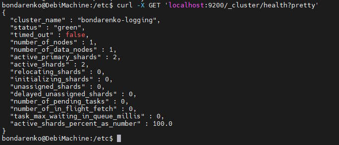
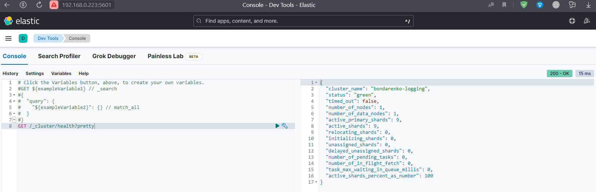
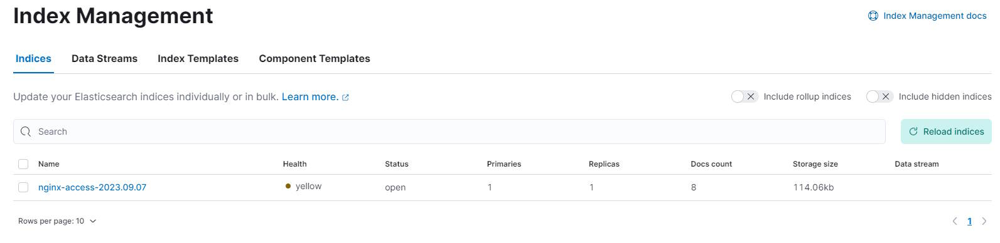
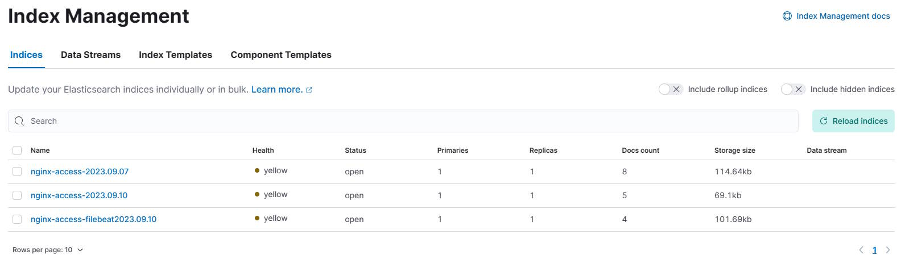

# Домашнее задание к занятию «ELK»

## Дополнительные ресурсы

При выполнении задания используйте дополнительные ресурсы:
- [docker-compose elasticsearch + kibana](11-03/docker-compose.yaml);
- [поднимаем elk в docker](https://www.elastic.co/guide/en/elasticsearch/reference/7.17/docker.html);
- [поднимаем elk в docker с filebeat и docker-логами](https://www.sarulabs.com/post/5/2019-08-12/sending-docker-logs-to-elasticsearch-and-kibana-with-filebeat.html);
- [конфигурируем logstash](https://www.elastic.co/guide/en/logstash/7.17/configuration.html);
- [плагины filter для logstash](https://www.elastic.co/guide/en/logstash/current/filter-plugins.html);
- [конфигурируем filebeat](https://www.elastic.co/guide/en/beats/libbeat/5.3/config-file-format.html);
- [привязываем индексы из elastic в kibana](https://www.elastic.co/guide/en/kibana/7.17/index-patterns.html);
- [как просматривать логи в kibana](https://www.elastic.co/guide/en/kibana/current/discover.html);
- [решение ошибки increase vm.max_map_count elasticsearch](https://stackoverflow.com/questions/42889241/how-to-increase-vm-max-map-count).

### Задание 1. Elasticsearch 

Установите и запустите Elasticsearch, после чего поменяйте параметр cluster_name на случайный. 

*Приведите скриншот команды 'curl -X GET 'localhost:9200/_cluster/health?pretty', сделанной на сервере с установленным Elasticsearch. Где будет виден нестандартный cluster_name*.

## Ответ

Скачал deb пакет с зеркала яндекса и установил.
В ```/etc/elasticsearch/elasticsearch.yml``` убрал настройки безопасности ```xpack.security.enabled: false```.



---

### Задание 2. Kibana

Установите и запустите Kibana.

*Приведите скриншот интерфейса Kibana на странице http://<ip вашего сервера>:5601/app/dev_tools#/console, где будет выполнен запрос GET /_cluster/health?pretty*.

## Ответ

Скачал deb пакет с зеркала яндекса и установил. Версия Kibana должна совпадать с Elasticsearch по [таблице](https://www.elastic.co/support/matrix#matrix_compatibility).

В файле ```nano /etc/kibana/kibana.yml``` настроил 
```yml
server.host: "0.0.0.0"
elasticsearch.hosts: ["http://localhost:9200"]
```
Скрин



---

### Задание 3. Logstash

Установите и запустите Logstash и Nginx. С помощью Logstash отправьте access-лог Nginx в Elasticsearch. 

*Приведите скриншот интерфейса Kibana, на котором видны логи Nginx.*


## Ответ

Перенастроил все составляющие и получилось заставить это работать.


---

### Задание 4. Filebeat. 

Установите и запустите Filebeat. Переключите поставку логов Nginx с Logstash на Filebeat. 

*Приведите скриншот интерфейса Kibana, на котором видны логи Nginx, которые были отправлены через Filebeat.*


## Ответ

<details>
<summary>nginx-log.conf in conf.d</summary>

```yml
input {
  file {
    path => "/var/log/nginx/access.log"  # Путь к файлу логов Nginx
    start_position => "beginning"
    sincedb_path => "/dev/null"
    type => "nginx-access"
  }
  beats {
    port => 5044
    type => "nginx-access-filebeat"
  }
}

filter {
  if [type] == "nginx-access" {
    grok {
      match => { "message" => "%{COMBINEDAPACHELOG}" }
    }
    date {
      match => [ "timestamp", "dd/MMM/yyyy:HH:mm:ss Z" ]
      target => "@timestamp"
    }
  }
  if [type] == "nginx-access-filebeat" {
    grok {
        match => { "message" => "%{IP:client} %{WORD:method} %{URIPATHPARAM:request} %{NUMBER:bytes} %{NUMBER:duration}" }
    }

  }

}

output {
  if [type] == "nginx-access" {
    elasticsearch {
      hosts => ["192.168.0.223:9200"]  # Адрес Elasticsearch, куда отправлять логи
      index => "nginx-access-%{+YYYY.MM.dd}"
    }
  }
  if [type] == "nginx-access-filebeat" {
    elasticsearch {
      hosts => ["192.168.0.223:9200"]  # Адрес Elasticsearch, куда отправлять логи
      index => "nginx-access-filebeat%{+YYYY.MM.dd}"
    }
  }
  stdout {
    codec => rubydebug
  }
}
```
</details>

<details><summary>filebeat.yml</summary>

```yml
filebeat.inputs:
- type: log
  id: my-filestream-id
  enabled: true
  paths:
      - /var/log/nginx/access.log
      - /var/log/nginx/error.log
output.logstash:
  hosts: ["192.168.0.223:5044"]
```

</details>




## Дополнительные задания (со звёздочкой*)
Эти задания дополнительные, то есть не обязательные к выполнению, и никак не повлияют на получение вами зачёта по этому домашнему заданию. Вы можете их выполнить, если хотите глубже шире разобраться в материале.

### Задание 5*. Доставка данных 

Настройте поставку лога в Elasticsearch через Logstash и Filebeat любого другого сервиса , но не Nginx. 
Для этого лог должен писаться на файловую систему, Logstash должен корректно его распарсить и разложить на поля. 

*Приведите скриншот интерфейса Kibana, на котором будет виден этот лог и напишите лог какого приложения отправляется.*