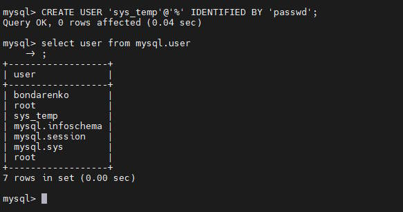
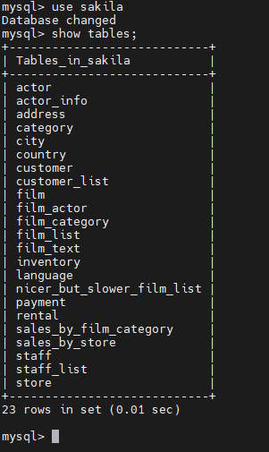
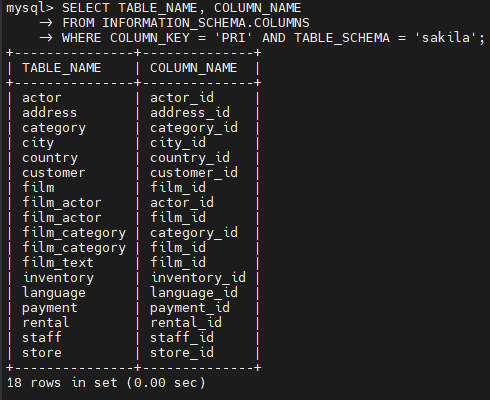
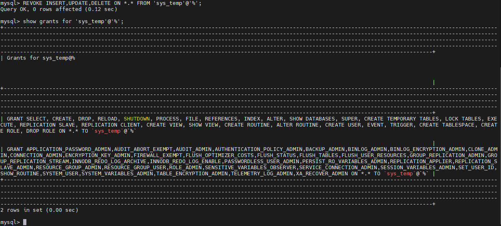

# Домашнее задание к занятию «Работа с данными (DDL/DML)»

### Задание 1
1.1. Поднимите чистый инстанс MySQL версии 8.0+. Можно использовать локальный сервер или контейнер Docker.

Я использовал контейнер докер. Скачал дамп базы и сделал маунт в контейнер.
```bash 
docker run --name mysql -e MYSQL_USER='bondarenko' -e MYSQL_PASSWORD=passwd -e MYSQL_ROOT_PASSWORD=passwd -v /home/bondarenko/mysqldb/:/var/mysqldb -d mysql
```
1.2. Создайте учётную запись sys_temp. 

Создал УЗ с помощью команды:
```sql
create user 'sys_temp'@'%' identified by 'passwd';
```

1.3. Выполните запрос на получение списка пользователей в базе данных. (скриншот)

Запрос списка пользователей выглядит так:
```sql
select user from mysql.user;
```


1.4. Дайте все права для пользователя sys_temp. 

```sql
grant all privileges on * . * to 'sys_temp'@'%';
```

1.5. Выполните запрос на получение списка прав для пользователя sys_temp. (скриншот)

Запрос:
```sql
show grants for 'sys_temp'@'%';
```


1.6. Переподключитесь к базе данных от имени sys_temp.

Подключаемся к базе под другой УЗ:

```bash
mysql -u sys_temp -p
```

1.6. По ссылке https://downloads.mysql.com/docs/sakila-db.zip скачайте дамп базы данных.

1.7. Восстановите дамп в базу данных.

После подлючения к базе делаем:

```sql
SOURCE /путь/до/базы/в/контейнере/sakila-schema.sql;
SOURCE /путь/до/базы/в/контейнере/sakila-data.sql;
```

1.8. При работе в IDE сформируйте ER-диаграмму получившейся базы данных. При работе в командной строке используйте команду для получения всех таблиц базы данных. (скриншот)

Выводим список таблиц:
```sql
show tables;
```



*Результатом работы должны быть скриншоты обозначенных заданий, а также простыня со всеми запросами.*


### Задание 2
Составьте таблицу, используя любой текстовый редактор или Excel, в которой должно быть два столбца: в первом должны быть названия таблиц восстановленной базы, во втором названия первичных ключей этих таблиц. Пример: (скриншот/текст)
```
Название таблицы | Название первичного ключа
customer         | customer_id
```

## Ответ



## Дополнительные задания (со звёздочкой*)
Эти задания дополнительные, то есть не обязательные к выполнению, и никак не повлияют на получение вами зачёта по этому домашнему заданию. Вы можете их выполнить, если хотите глубже шире разобраться в материале.

### Задание 3*
3.1. Уберите у пользователя sys_temp права на внесение, изменение и удаление данных из базы sakila.

Команда для снятия прав:
```sql
REVOKE INSERT,UPDATE,DELETE ON *.* FROM 'sys_temp'@'%';
```

3.2. Выполните запрос на получение списка прав для пользователя sys_temp. (скриншот)

```sql
SHOW GRANTS FOR 'sys_temp'@'%';
```



*Результатом работы должны быть скриншоты обозначенных заданий, а также простыня со всеми запросами.*