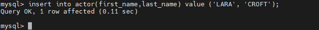
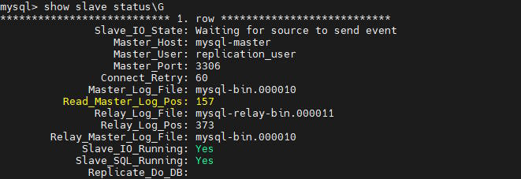
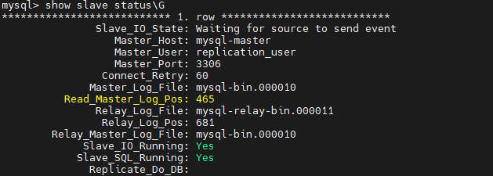

# Домашнее задание к занятию «Репликация и масштабирование. Часть 1»

### Задание 1

На лекции рассматривались режимы репликации master-slave, master-master, опишите их различия.

*Ответить в свободной форме.*

## Ответ
Оба режима служат для повышения отказоустойчивости.
Репликация master-slave используется для распределения нагрузки чтения из базы данных.
Репликация master-master нужна чтобы обеспечить высокую доступность и распределение нагрузки на запись.

---

### Задание 2

Выполните конфигурацию master-slave репликации, примером можно пользоваться из лекции.

*Приложите скриншоты конфигурации, выполнения работы: состояния и режимы работы серверов.*


## Ответ

<details><summary>SLAVE</summary>

```yml
# For advice on how to change settings please see
# http://dev.mysql.com/doc/refman/8.1/en/server-configuration-defaults.html

[mysqld]
#
# Remove leading # and set to the amount of RAM for the most important data
# cache in MySQL. Start at 70% of total RAM for dedicated server, else 10%.
# innodb_buffer_pool_size = 128M
#
# Remove leading # to turn on a very important data integrity option: logging
# changes to the binary log between backups.
# log_bin
#
# Remove leading # to set options mainly useful for reporting servers.
# The server defaults are faster for transactions and fast SELECTs.
# Adjust sizes as needed, experiment to find the optimal values.
# join_buffer_size = 128M
# sort_buffer_size = 2M
# read_rnd_buffer_size = 2M

# Remove leading # to revert to previous value for default_authentication_plugin,
# this will increase compatibility with older clients. For background, see:
# https://dev.mysql.com/doc/refman/8.1/en/server-system-variables.html#sysvar_default_authentication_plugin
# default-authentication-plugin=mysql_native_password
log_bin = mysql-bin
server_id = 2
relay-log = /var/lib/mysql/mysql-relay-bin
relay-log-index = /var/lib/mysql/mysql-relay-bin.index
read_only = 1

default_authentication_plugin = caching_sha2_password
#require_secure_transport = ON

skip-host-cache
skip-name-resolve
datadir=/var/lib/mysql
socket=/var/run/mysqld/mysqld.sock
secure-file-priv=/var/lib/mysql-files
user=mysql

pid-file=/var/run/mysqld/mysqld.pid
[client]
socket=/var/run/mysqld/mysqld.sock

!includedir /etc/mysql/conf.d/

```

</details>

<details><summary>MASTER</summary>

```yml
# For advice on how to change settings please see
# http://dev.mysql.com/doc/refman/8.1/en/server-configuration-defaults.html

[mysqld]
#
# Remove leading # and set to the amount of RAM for the most important data
# cache in MySQL. Start at 70% of total RAM for dedicated server, else 10%.
# innodb_buffer_pool_size = 128M
#
# Remove leading # to turn on a very important data integrity option: logging
# changes to the binary log between backups.
# log_bin
#
# Remove leading # to set options mainly useful for reporting servers.
# The server defaults are faster for transactions and fast SELECTs.
# Adjust sizes as needed, experiment to find the optimal values.
# join_buffer_size = 128M
# sort_buffer_size = 2M
# read_rnd_buffer_size = 2M

# Remove leading # to revert to previous value for default_authentication_plugin,
# this will increase compatibility with older clients. For background, see:
# https://dev.mysql.com/doc/refman/8.1/en/server-system-variables.html#sysvar_default_authentication_plugin
default-authentication-plugin=mysql_native_password
server_id = 1
log_bin = mysql-bin

default_authentication_plugin = caching_sha2_password
#require_secure_transport = ON

skip-host-cache
skip-name-resolve
datadir=/var/lib/mysql
socket=/var/run/mysqld/mysqld.sock
secure-file-priv=/var/lib/mysql-files
user=mysql

pid-file=/var/run/mysqld/mysqld.pid
[client]
socket=/var/run/mysqld/mysqld.sock

!includedir /etc/mysql/conf.d/

```

</details>
---

Произвел запись в мастер:



До записи:



После записи:



## Дополнительные задания (со звёздочкой*)
Эти задания дополнительные, то есть не обязательные к выполнению, и никак не повлияют на получение вами зачёта по этому домашнему заданию. Вы можете их выполнить, если хотите глубже шире разобраться в материале.

---

### Задание 3* 

Выполните конфигурацию master-master репликации. Произведите проверку.

*Приложите скриншоты конфигурации, выполнения работы: состояния и режимы работы серверов.*