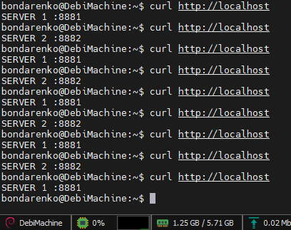
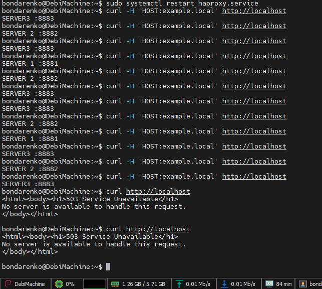
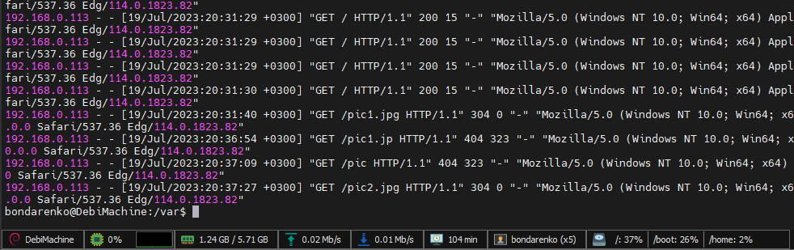
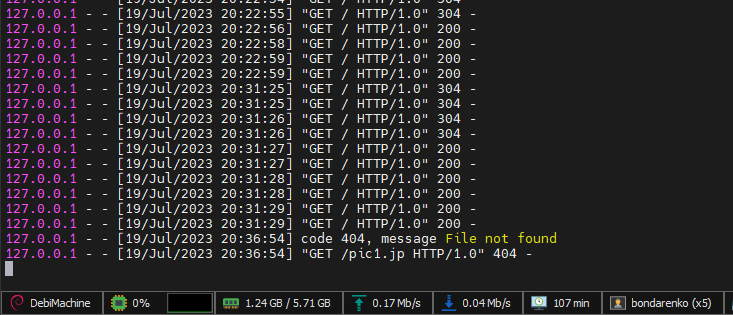
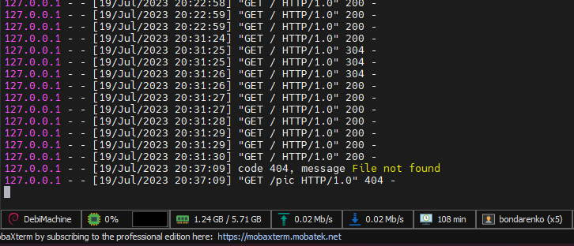
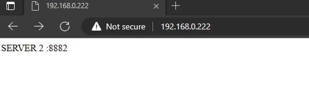
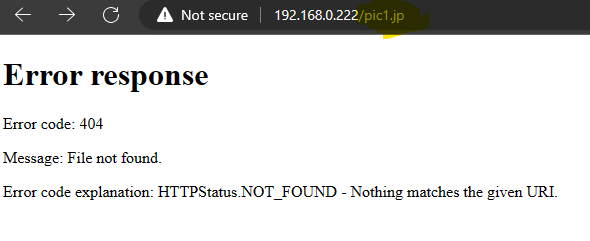
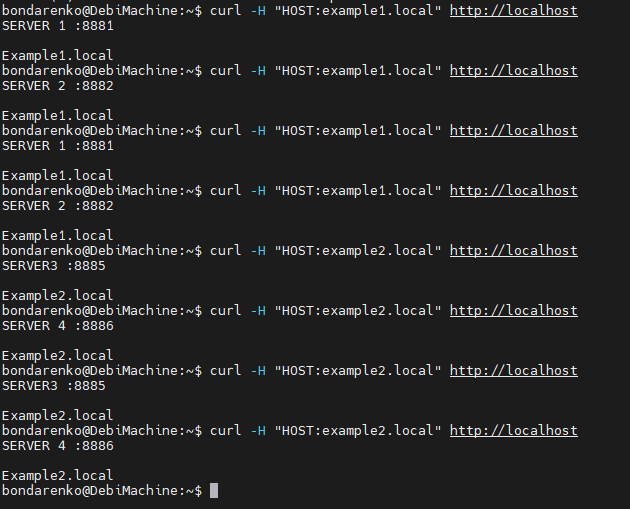

# Домашнее задание к занятию 2 «Кластеризация и балансировка нагрузки»

### Задание 1
- Запустите два simple python сервера на своей виртуальной машине на разных портах
- Установите и настройте HAProxy, воспользуйтесь материалами к лекции по [ссылке](2/)
- Настройте балансировку Round-robin на 4 уровне.
- На проверку направьте конфигурационный файл haproxy, скриншоты, где видно перенаправление запросов на разные серверы при обращении к HAProxy.

### *Ответ*

[haproxy.cfg](./homework-2/haproxy.cfg)




### Задание 2
- Запустите три simple python сервера на своей виртуальной машине на разных портах
- Настройте балансировку Weighted Round Robin на 7 уровне, чтобы первый сервер имел вес 2, второй - 3, а третий - 4
- HAproxy должен балансировать только тот http-трафик, который адресован домену example.local
- На проверку направьте конфигурационный файл haproxy, скриншоты, где видно перенаправление запросов на разные серверы при обращении к HAProxy c использованием домена example.local и без него.

### *Ответ*

[haproxy.cfg](./homework-2/2-haproxy.cfg)




### Задание 3*
- Настройте связку HAProxy + Nginx как было показано на лекции.
- Настройте Nginx так, чтобы файлы .jpg выдавались самим Nginx (предварительно разместите несколько тестовых картинок в директории /var/www/), а остальные запросы переадресовывались на HAProxy, который в свою очередь переадресовывал их на два Simple Python server.
- На проверку направьте конфигурационные файлы nginx, HAProxy, скриншоты с запросами jpg картинок и других файлов на Simple Python Server, демонстрирующие корректную настройку.

### *Ответ*

Конфиг /etc/nginx/conf.d/some-site.com

```yml
server {

        listen 80;
        server_name some-site.com;

        root /var/www;

        access_log       /var/log/nginx/some-site.com-access.log;
        error_log        /var/log/nginx/some-site.com-error.log;


        location / {
                try_files $uri @haproxy;
        }

        location ~ \.jpg$ {
                try_files $uri =404;
        }

        location @haproxy {
                proxy_pass http://localhost:8884;
        }

}
```

рабочая часть haproxy.cfg

```yml
listen web_tcp
        bind :8884

        mode tcp
        balance roundrobin

        server ser1 127.0.0.1:8881 check inter 3s
        server ser2 127.0.0.1:8882 check inter 3s
```

Скрин access-лога nginx



Server1



Server2



Скриншоты браузера:






### Задание 4*
- Запустите 4 simple python сервера на разных портах.
- Первые два сервера будут выдавать страницу index.html вашего сайта example1.local (в файле index.html напишите example1.local)
- Вторые два сервера будут выдавать страницу index.html вашего сайта example2.local (в файле index.html напишите example2.local)
- Настройте два бэкенда HAProxy
- Настройте фронтенд HAProxy так, чтобы в зависимости от запрашиваемого сайта example1.local или example2.local запросы перенаправлялись на разные бэкенды HAProxy
- На проверку направьте конфигурационный файл HAProxy, скриншоты, демонстрирующие запросы к разным фронтендам и ответам от разных бэкендов.

### *Ответ*

haproxy.cfg

```yml
frontend http-site
        mode http
        bind :80
        acl example1 hdr(host) -i example1.local
        acl example2 hdr(host) -i example2.local
        use_backend python-servers1 if example1
        use_backend python-servers2 if example2

backend python-servers1
        mode http
        balance roundrobin
        option httpchk
        http-check send meth GET uri /index.html
        server ser1 127.0.0.1:8881
        server ser2 127.0.0.1:8882

backend python-servers2
        mode http
        balance roundrobin
        option httpchk
        http-check send meth GET uri /index.html
        server ser1 127.0.0.1:8885
        server ser2 127.0.0.1:8886

```

Скрин с результатами запросов


