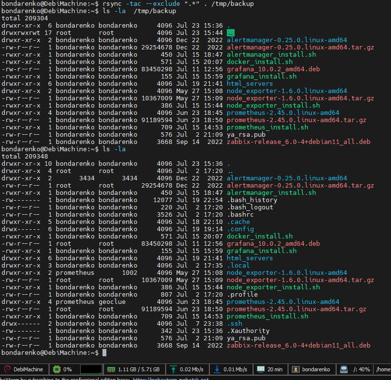
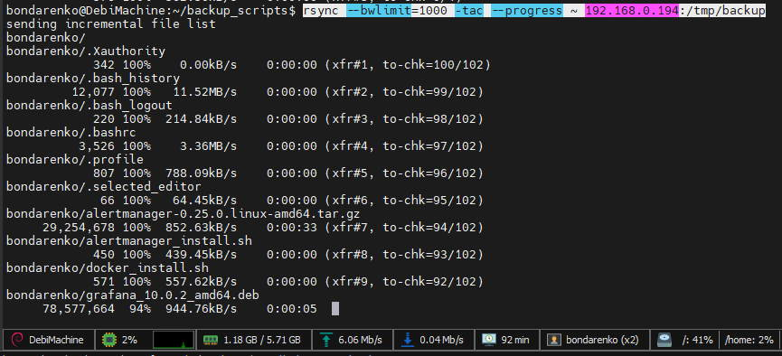

# Домашнее задание к занятию 3 «Резервное копирование»

### Задание 1
- Составьте команду rsync, которая позволяет создавать зеркальную копию домашней директории пользователя в директорию `/tmp/backup`
- Необходимо исключить из синхронизации все директории, начинающиеся с точки (скрытые)
- Необходимо сделать так, чтобы rsync подсчитывал хэш-суммы для всех файлов, даже если их время модификации и размер идентичны в источнике и приемнике.
- На проверку направить скриншот с командой и результатом ее выполнения


### *Ответ*

Команда
```sh
:~$ rsync -tac --exclude ".*" . /tmp/backup
```
Скрин результата




### Задание 2
- Написать скрипт и настроить задачу на регулярное резервное копирование домашней директории пользователя с помощью rsync и cron.
- Резервная копия должна быть полностью зеркальной
- Резервная копия должна создаваться раз в день, в системном логе должна появляться запись об успешном или неуспешном выполнении операции
- Резервная копия размещается локально, в директории `/tmp/backup`
- На проверку направить файл crontab и скриншот с результатом работы утилиты.

### *Ответ*

запись в crontab
```sh
0 3 * * * /home/bondarenko/backup_scripts/backup_home.sh
```

скрипт копирования и запись в лог

```sh
#!/bin/bash

# Указываем путь к директории, которую нужно скопировать.
source_dir="/home/bondarenko/"

# Указываем путь к месту, где будет храниться резервная копия.
backup_dir="/tmp/backup"

# Имя лог-файла и его расположение.
log_file="/var/log/rsync_backup.log"

# Выполняем резервное копирование с помощью rsync.
rsync -tacv "$source_dir" "$backup_dir" &>> "$log_file"

# Проверяем код возврата rsync и записываем результат в лог-файл.
if [ $? -eq 0 ]; then
    echo "Успешное резервное копирование: $(date)" >> "$log_file"
else
    echo "Ошибка при резервном копировании: $(date)" >> "$log_file"
fi
```

### Задание 3*
- Настройте ограничение на используемую пропускную способность rsync до 1 Мбит/c
- Проверьте настройку, синхронизируя большой файл между двумя серверами
- На проверку направьте команду и результат ее выполнения в виде скриншота

### *Ответ*

Команда выглядит так:
```sh
rsync --bwlimit=1000 -tac --progress ~ 192.168.0.194:/tmp/backup
```

Скрин выполнения:



### Задание 4*
- Напишите скрипт, который будет производить инкрементное резервное копирование домашней директории пользователя с помощью rsync на другой сервер
- Скрипт должен удалять старые резервные копии (сохранять только последние 5 штук)
- Напишите скрипт управления резервными копиями, в нем можно выбрать резервную копию и данные восстановятся к состоянию на момент создания данной резервной копии.
- На проверку направьте скрипт и скриншоты, демонстрирующие его работу в различных сценариях.