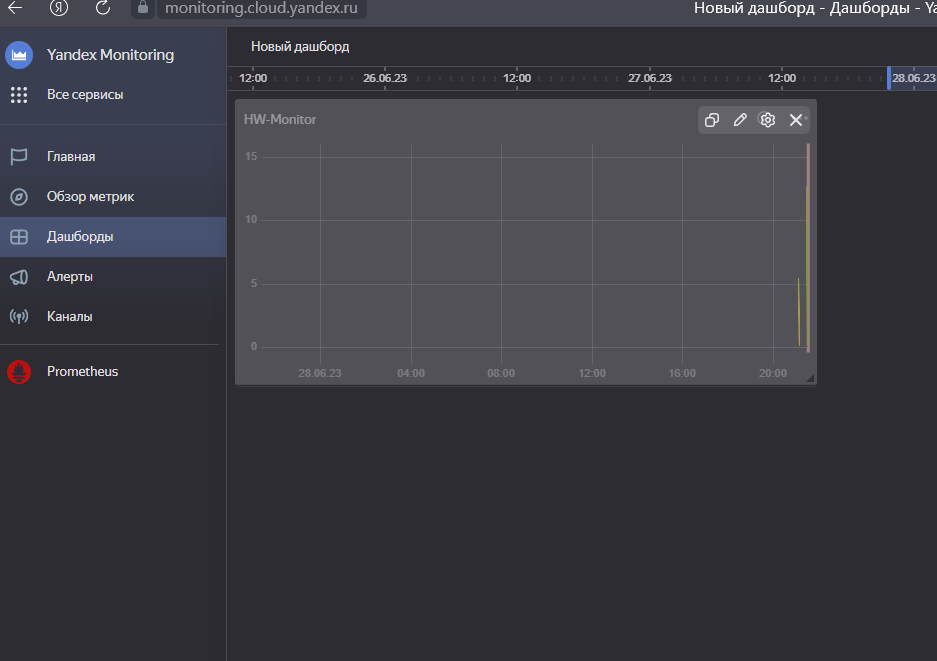
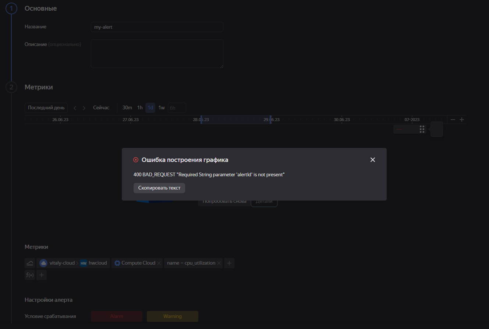

# Домашнее задание к занятию «Обзор систем IT-мониторинга»

### Задание 1

Создайте виртуальную машину в Yandex Compute Cloud и с помощью Yandex Monitoring создайте дашборд, на котором будет видно загрузку процессора.

#### Требования к результату
* прикрепите в файл README.md скриншот вашего дашборда в Yandex Monitoring с мониторингом загрузки процессора виртуальной машины   

### *Ответ*

### Задание 2 со звёздочкой*

С помощью Yandex Monitoring сделайте 2 алерта на загрузку процессора: WARN и ALARM. Создайте уведомление по e-mail.

#### Требования к результату
* прикрепите в файл README.md скриншот уведомления в Yandex Monitoring 

### *Ответ*

При попытке создать алерт на яндексе получаю ошибку.

