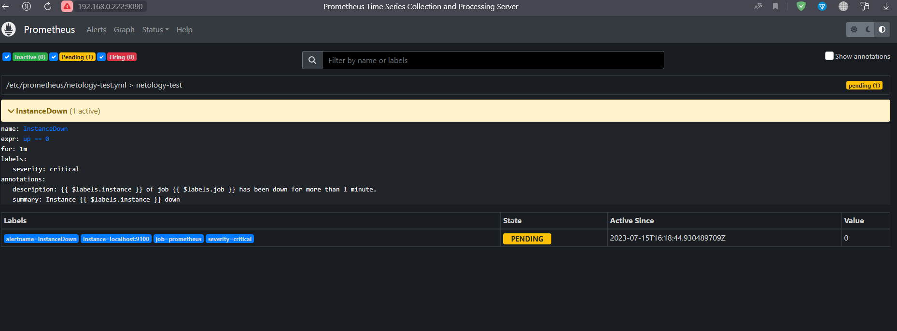

# Домашнее задание к занятию «Prometheus. Часть 2»

### Задание 1
Создайте файл с правилом оповещения, как в лекции, и добавьте его в конфиг Prometheus.

### Требования к результату
- [ ] Погасите node exporter, стоящий на мониторинге, и прикрепите скриншот раздела оповещений Prometheus, где оповещение будет в статусе Pending

### *Ответ*

### Задание 2
Установите Alertmanager и интегрируйте его с Prometheus.

### Требования к результату
- [ ] Прикрепите скриншот Alerts из Prometheus, где правило оповещения будет в статусе Fireing, и скриншот из Alertmanager, где будет видно действующее правило оповещения

### *Ответ*

### Задание 3

Активируйте экспортёр метрик в Docker и подключите его к Prometheus.

### Требования к результату
- [ ] приложите скриншот браузера с открытым эндпоинтом, а также скриншот списка таргетов из интерфейса Prometheus.*

### *Ответ*

### Задание 4* со звездочкой 

Создайте свой дашборд Grafana с различными метриками Docker и сервера, на котором он стоит.

### Требования к результату
- [ ] Приложите скриншот, на котором будет дашборд Grafana с действующей метрикой

### *Ответ*

