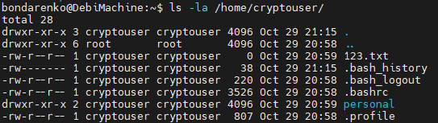
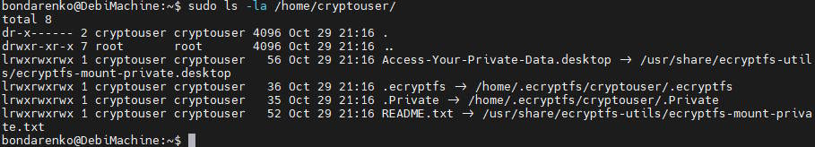

# Домашнее задание к занятию  «Защита хоста»

### Задание 1

1. Установите **eCryptfs**.
2. Добавьте пользователя cryptouser.
3. Зашифруйте домашний каталог пользователя с помощью eCryptfs.


*В качестве ответа  пришлите снимки экрана домашнего каталога пользователя с исходными и зашифрованными данными.*  

## Ответ

Во-первых необходимо установить ```sudo apt install ecryptfs-utils```

Но этого оказалось недостаточно. Программе требуется rsync для работы ```sudo apt install rsync```



Выполняем команду шифрации ```sudo ecryptfs-migrate-home -u cryptouser```

После удачного выполнения команды результат такой:



### Задание 2

1. Установите поддержку **LUKS**.
2. Создайте небольшой раздел, например, 100 Мб.
3. Зашифруйте созданный раздел с помощью LUKS.

*В качестве ответа пришлите снимки экрана с поэтапным выполнением задания.*

## Ответ

```console
bondarenko@DebiMachine:~$ sudo cryptsetup --verbose --verify-passphrase luksFormat /dev/sdb1
WARNING: Device /dev/sdb1 already contains a 'ext4' superblock signature.

WARNING!
========
This will overwrite data on /dev/sdb1 irrevocably.

Are you sure? (Type 'yes' in capital letters): YES
Enter passphrase for /dev/sdb1:
Verify passphrase:
Existing 'ext4' superblock signature (offset: 1080 bytes) on device /dev/sdb1 will be wiped.
Key slot 0 created.
Command successful.
bondarenko@DebiMachine:~$ sudo cryptsetup luksOpen /dev/sdb1 luksedDisk
Enter passphrase for /dev/sdb1:

bondarenko@DebiMachine:~$ sudo ls /dev/mapper/
control                 DebiMachine--vg-root    luksedDisk
DebiMachine--vg-home    DebiMachine--vg-swap_1

bondarenko@DebiMachine:~$  sudo dd if=/dev/zero of=/dev/mapper/luksedDisk
dd: writing to '/dev/mapper/luksedDisk': No space left on device
167937+0 records in
167936+0 records out
85983232 bytes (86 MB, 82 MiB) copied, 20.3721 s, 4.2 MB/s

bondarenko@DebiMachine:~$ sudo mkfs.ext4 /dev/mapper/luksedDisk
mke2fs 1.46.2 (28-Feb-2021)
Creating filesystem with 83968 1k blocks and 21032 inodes
Filesystem UUID: fe813f1f-7cac-4644-a24d-0d457a0ee886
Superblock backups stored on blocks:
        8193, 24577, 40961, 57345, 73729

Allocating group tables: done
Writing inode tables: done
Creating journal (4096 blocks): done
Writing superblocks and filesystem accounting information: done

bondarenko@DebiMachine:~$ mkdir .secret

bondarenko@DebiMachine:~$ sudo mount /dev/mapper/luksedDisk .secret/
bondarenko@DebiMachine:~$ touch .secret/123.txt
touch: cannot touch '.secret/123.txt': Permission denied

bondarenko@DebiMachine:~$ sudo chown bondarenko .secret/

bondarenko@DebiMachine:~$ touch .secret/123.txt

bondarenko@DebiMachine:~$ ls -la .secret
total 17
drwxr-xr-x  3 bondarenko root        1024 Oct 30 21:19 .
drwxr-xr-x 18 bondarenko bondarenko  4096 Oct 30 21:17 ..
-rw-r--r--  1 bondarenko bondarenko     0 Oct 30 21:19 123.txt
drwx------  2 root       root       12288 Oct 30 21:15 lost+found
bondarenko@DebiMachine:~$ sudo umount .secret
bondarenko@DebiMachine:~$ sudo cryptsetup luksClose luksedDisk
bondarenko@DebiMachine:~$ ls -la .secret
total 8
drwxr-xr-x  2 bondarenko bondarenko 4096 Oct 30 21:17 .
drwxr-xr-x 18 bondarenko bondarenko 4096 Oct 30 21:17 ..
bondarenko@DebiMachine:~$ ls /dev/mapper/
control  DebiMachine--vg-home  DebiMachine--vg-root  DebiMachine--vg-swap_1
```

## Дополнительные задания (со звёздочкой*)

Эти задания дополнительные, то есть не обязательные к выполнению, и никак не повлияют на получение вами зачёта по этому домашнему заданию. Вы можете их выполнить, если хотите глубже шире разобраться в материале

### Задание 3 *

1. Установите **apparmor**.
2. Повторите эксперимент, указанный в лекции.
3. Отключите (удалите) apparmor.


*В качестве ответа пришлите снимки экрана с поэтапным выполнением задания.*

## Ответ

```sudo apt install apparmor-profiles apparmor-utils apparmor-profiles-extra```

```console
bondarenko@DebiMachine:~$ sudo apparmor_status
[sudo] password for bondarenko:
apparmor module is loaded.
45 profiles are loaded.
27 profiles are in enforce mode.
   /usr/bin/evince
   /usr/bin/evince-previewer
   /usr/bin/evince-previewer//sanitized_helper
   /usr/bin/evince-thumbnailer
   /usr/bin/evince//sanitized_helper
   /usr/bin/man
   /usr/bin/pidgin
   /usr/bin/pidgin//sanitized_helper
   /usr/bin/totem
   /usr/bin/totem-audio-preview
   /usr/bin/totem-video-thumbnailer
   /usr/bin/totem//sanitized_helper
   /usr/lib/cups/backend/cups-pdf
   /usr/sbin/cups-browsed
   /usr/sbin/cupsd
   /usr/sbin/cupsd//third_party
   apt-cacher-ng
   docker-default
   libreoffice-senddoc
   libreoffice-soffice//gpg
   libreoffice-xpdfimport
   lsb_release
   man_filter
   man_groff
   nvidia_modprobe
   nvidia_modprobe//kmod
   tcpdump
18 profiles are in complain mode.
   /usr/bin/irssi
   /usr/sbin/dnsmasq
   /usr/sbin/dnsmasq//libvirt_leaseshelper
   avahi-daemon
   identd
   klogd
   libreoffice-oopslash
   libreoffice-soffice
   mdnsd
   nmbd
   nscd
   ping
   smbd
   smbldap-useradd
   smbldap-useradd///etc/init.d/nscd
   syslog-ng
   syslogd
   traceroute
5 processes have profiles defined.
3 processes are in enforce mode.
   /usr/sbin/cups-browsed (582)
   /usr/sbin/cupsd (544)
   /usr/lib/cups/notifier/dbus (581) /usr/sbin/cupsd
2 processes are in complain mode.
   /usr/sbin/avahi-daemon (474) avahi-daemon
   /usr/sbin/avahi-daemon (514) avahi-daemon
0 processes are unconfined but have a profile defined.
bondarenko@DebiMachine:~$  sudo cp /usr/bin/man /usr/bin/man1
bondarenko@DebiMachine:~$  sudo cp /bin/ping /usr/bin/man
bondarenko@DebiMachine:~$ sudo man 127.0.0.1
man: socket: Operation not permitted
bondarenko@DebiMachine:~$ sudo man ya.ru
man: socket: Operation not permitted

bondarenko@DebiMachine:~$ sudo aa-complain /usr/bin/man
Setting /usr/bin/man to complain mode.
bondarenko@DebiMachine:~$ sudo man 127.0.0.1
PING 127.0.0.1 (127.0.0.1) 56(84) bytes of data.
64 bytes from 127.0.0.1: icmp_seq=1 ttl=64 time=0.023 ms
64 bytes from 127.0.0.1: icmp_seq=2 ttl=64 time=0.027 ms
64 bytes from 127.0.0.1: icmp_seq=3 ttl=64 time=0.024 ms
64 bytes from 127.0.0.1: icmp_seq=4 ttl=64 time=0.024 ms
^C
--- 127.0.0.1 ping statistics ---
4 packets transmitted, 4 received, 0% packet loss, time 3400ms

bondarenko@DebiMachine:~$ sudo aa-enforce /usr/bin/man
Setting /usr/bin/man to enforce mode.
bondarenko@DebiMachine:~$ sudo man 127.0.0.1
man: socket: Operation not permitted

bondarenko@DebiMachine:~$ sudo service apparmor stop
bondarenko@DebiMachine:~$ sudo service apparmor teardown
Usage: /etc/init.d/apparmor {start|stop|restart|reload|force-reload|status}

bondarenko@DebiMachine:~$ sudo apt remove apparmor apparmor-profiles apparmor-utils apparmor-profiles-extra
Reading package lists... Done
Building dependency tree... Done
Reading state information... Done
The following packages were automatically installed and are no longer required:
  docker-buildx-plugin docker-compose-plugin libslirp0 python3-apparmor python3-libapparmor slirp4netns
Use 'sudo apt autoremove' to remove them.
The following packages will be REMOVED:
  apparmor apparmor-profiles apparmor-profiles-extra apparmor-utils
0 upgraded, 0 newly installed, 4 to remove and 102 not upgraded.
After this operation, 3,413 kB disk space will be freed.
Do you want to continue? [Y/n] y
(Reading database ... 146037 files and directories currently installed.)
Removing apparmor-profiles-extra (1.34) ...
Removing apparmor-profiles (2.13.6-10) ...
Removing apparmor-utils (2.13.6-10) ...
Removing apparmor (2.13.6-10) ...
Processing triggers for man-db (2.9.4-2) ...

bondarenko@DebiMachine:~$ sudo apt remove --assume-yes --purge apparmor
Reading package lists... Done
Building dependency tree... Done
Reading state information... Done
The following packages were automatically installed and are no longer required:
  docker-buildx-plugin docker-compose-plugin libslirp0 python3-apparmor python3-libapparmor slirp4netns
Use 'sudo apt autoremove' to remove them.
The following packages will be REMOVED:
  apparmor*
0 upgraded, 0 newly installed, 1 to remove and 102 not upgraded.
After this operation, 0 B of additional disk space will be used.
(Reading database ... 145758 files and directories currently installed.)
Purging configuration files for apparmor (2.13.6-10) ...
dpkg: warning: while removing apparmor, directory '/etc/apparmor.d/local' not empty so not removed
```
После перезагрузки

```console
bondarenko@DebiMachine:~$ sudo man ya.ru
PING ya.ru (5.255.255.242) 56(84) bytes of data.
64 bytes from ya.ru (5.255.255.242): icmp_seq=1 ttl=250 time=4.80 ms
64 bytes from ya.ru (5.255.255.242): icmp_seq=2 ttl=250 time=10.5 ms
64 bytes from ya.ru (5.255.255.242): icmp_seq=3 ttl=250 time=4.44 ms
64 bytes from ya.ru (5.255.255.242): icmp_seq=4 ttl=250 time=4.51 ms
64 bytes from ya.ru (5.255.255.242): icmp_seq=5 ttl=250 time=5.62 ms
64 bytes from ya.ru (5.255.255.242): icmp_seq=6 ttl=250 time=12.9 ms
64 bytes from ya.ru (5.255.255.242): icmp_seq=7 ttl=250 time=4.97 ms
64 bytes from ya.ru (5.255.255.242): icmp_seq=8 ttl=250 time=11.7 ms
64 bytes from ya.ru (5.255.255.242): icmp_seq=9 ttl=250 time=4.82 ms
^C
--- ya.ru ping statistics ---
9 packets transmitted, 9 received, 0% packet loss, time 10401ms
rtt min/avg/max/mdev = 4.435/7.140/12.872/3.290 ms
```