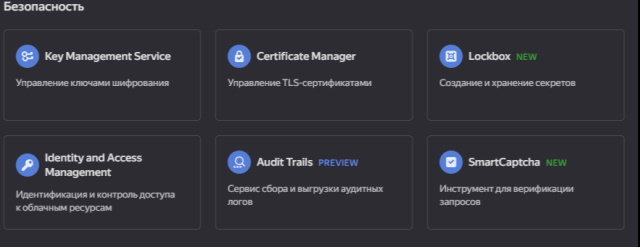
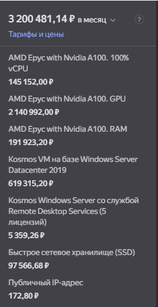
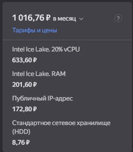
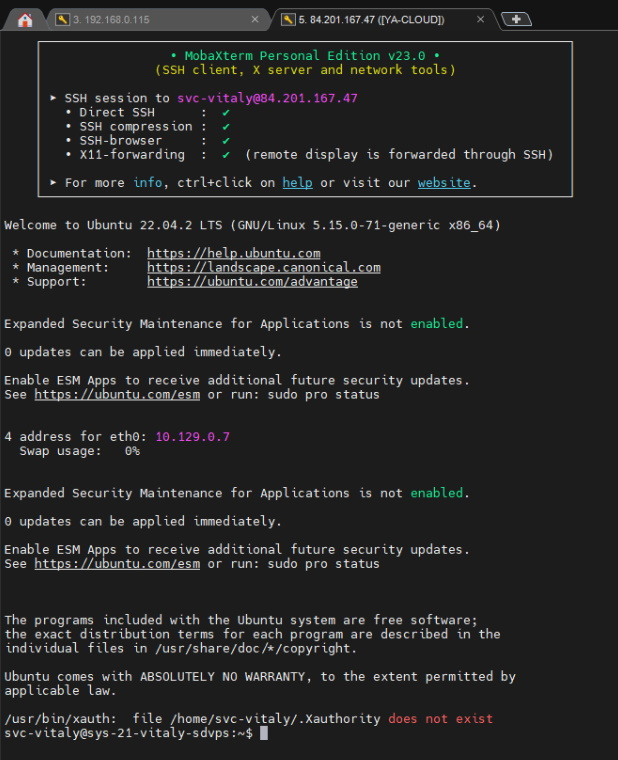

# Домашнее задание к занятию «Виртуализация и облачные решения: AWS, GCP, Yandex Cloud, OpenStack»

## Задание 1

*Ответьте на вопрос в свободной форме. Чем частное облако отличается от общедоступного, публичного и гибридного?*

В частном облаке все ресурсы изолированы и контролируются одной организации. Частное облако также называют внутренним или корпоративным облаком.  Это может быть ресурс организованный одной компанией для себя либо арендованный стек оборудования в ЦОД.

## Задание 2

*Что обозначают: IaaS, PaaS, SaaS, CaaS, DRaaS, BaaS, DBaaS, MaaS, DaaS, NaaS, STaaS? Напишите примеры их использования.*

IaaS - 

PaaS - Platform as a Service — предосталение облачных инструментов для разработки

SaaS - Software as a Service — готовое облачное приложение (Google Docs, Dropbox) 

CaaS - Контейнеры как сервис (CaaS) — это облачный сервис, который позволяет разработчикам программного обеспечения и отделам ИТ загружать, упорядочивать, запускать и масштабировать контейнеры, а также управлять ими с помощью контейнерной виртуализации.

DRaaS - Аварийное восстановление как услуга, представляет собой категорию облачных услуг, используемых для защиты приложений или данных от природных или рукотворных катастроф путём полного восстановления пострадавшей IT-системы в облаке 

BaaS - Backend-as-a-Service позволяет передать ответственность за запуск и работу серверов третьей стороне, и тем самым сосредоточиться на других задачах.  BaaS-функции включают в себя облачное хранилище, push-уведомления, управление пользователями и файлами, службы определения местоположения и др. 

DBaaS - Database-as-a-service — это облачная база данных как услуга. Компания хранит, изменяет данные и управляет ими на облачной платформе, не создавая собственную инфраструктуру. 

MaaS - Monitoring as a service - платформа, которая облегчает развертывание функций мониторинга для различных других сервисов и приложений в облаке. Наиболее распространенным приложением для maas является онлайн-мониторинг состояния, который непрерывно отслеживает определенные состояния приложений, сетей, систем, экземпляров или любого элемента, которые могут быть развернуты в облаке

DaaS - При предоставлении услуги DaaS клиенты получают полностью готовое к работе («под ключ») стандартизированное виртуальное рабочее место, которое каждый пользователь имеет возможность дополнительно настраивать под свои задачи. Таким образом, пользователь получает доступ не к отдельной программе, а к необходимому для полноценной работы программному комплексу. 

NaaS -  Network-as-a-service - NaaS основан на эксплуатации сервисов транспортных соединений, или, проще говоря, на продаже сетевых услуг клиентам, не желающим строить собственную сетевую инфраструктуру. Сервис может включать функционал, обеспечивающий организацию WAN-соединений, подключений к ЦОД, в том числе организацию пропускной полосы по требованию, обеспечение безопасности и другое. NaaS чаще выступает дополнением облачных сервисов, поставляемых в модели IaaS, SaaS, PaaS.

STaaS — Storage-as-a-service – это услуга «хранение как сервис», которая дает возможность сохранять данные на внешнем носителе в облаке хостинг-провайдера, который на стороне пользователя выглядит как дополнительный логический диск или папка.
 

## Задание 3

*Ответьте на вопрос в свободной форме. Напишите, какой вид сервиса предоставляется пользователю в ситуациях:*

Всеми процессами управляет провайдер.  **SaaS**

Вы управляете приложением и данными, остальным управляет провайдер.
Тут скорее PaaS и больше похоже на хостинг для сайта, например.
Вы управляете операционной системой, средой исполнения, данными, приложениями, остальными управляет провайдер.
IaaS
Вы управляете сетью, хранилищами, серверами, виртуализацией, операционной системой, средой исполнения, данными, приложениями.
On-Site

 

## Задание 4
Вы работаете ИТ-специалистом в своей компании. Перед вами встал вопрос: покупать физический сервер или арендовать облачный сервис от Yandex Cloud.
Выполните действия и приложите скриншоты по каждому этапу:

Создать платёжный аккаунт:
зайти в консоль;
выбрать меню биллинг;
зарегистрировать аккаунт.
После регистрации выбрать меню в консоли Computer cloud.
Приступить к созданию виртуальной машины.

Ответьте на вопросы в свободной форме:

**Какие ОС можно выбрать?**

    Ubuntu 22.04 
    CentOS 7 
    Debian 11 
    Fedora 35 
    openSUSE Leap 15.3 
    Fedora CoreOS 35 
    AlmaLinux 8 
    CentOS Stream 8 
    REDOS 7.3 
    FreeBSD 13.1 
    Kosmos VM 2022 
    Astra Linux 1.7 «Воронеж» (серт.) 
    Роса Хром Рабочая станция 12.3 
    ALT Linux 10 
    Datacenter 2019 
    Альт Сервер 10.0 
    Альт СП Сервер 8 
    Роса Хром Сервер 12.3

**Какие параметры сервера можно выбрать?**

    Тип запоминающего устройства и объем 
    Процессор 
    Гарантированная доля vCPU 
    Размер ОЗУ 
    Подсеть 
    Публичный адрес 
    Внутренний адрес 
    DNS

**Какие компоненты мониторинга можно создать?**

    Можно добавить мониторинг процессора, диска и сети.

**Какие системы безопасности предусмотрены?**

**Как меняется цена от выбранных характеристик? Приведите пример самой дорогой и самой дешёвой конфигурации.**

    Цена меняется почти от всего.
 

Дополнительные задания* (со звёздочкой)
Их выполнение необязательное и не влияет на получение зачёта по домашнему заданию. Можете их решить, если хотите лучше разобраться в материале.

## Задание 5*
Выполните действия и приложите скриншот:

	Создайте виртуальную машину на Yandex Cloud.
	Создайте сервисный аккаунт.
	Отсканируйте SSH-ключ.
	Придумайте логин.
	Подключитесь к облаку через SSH.

