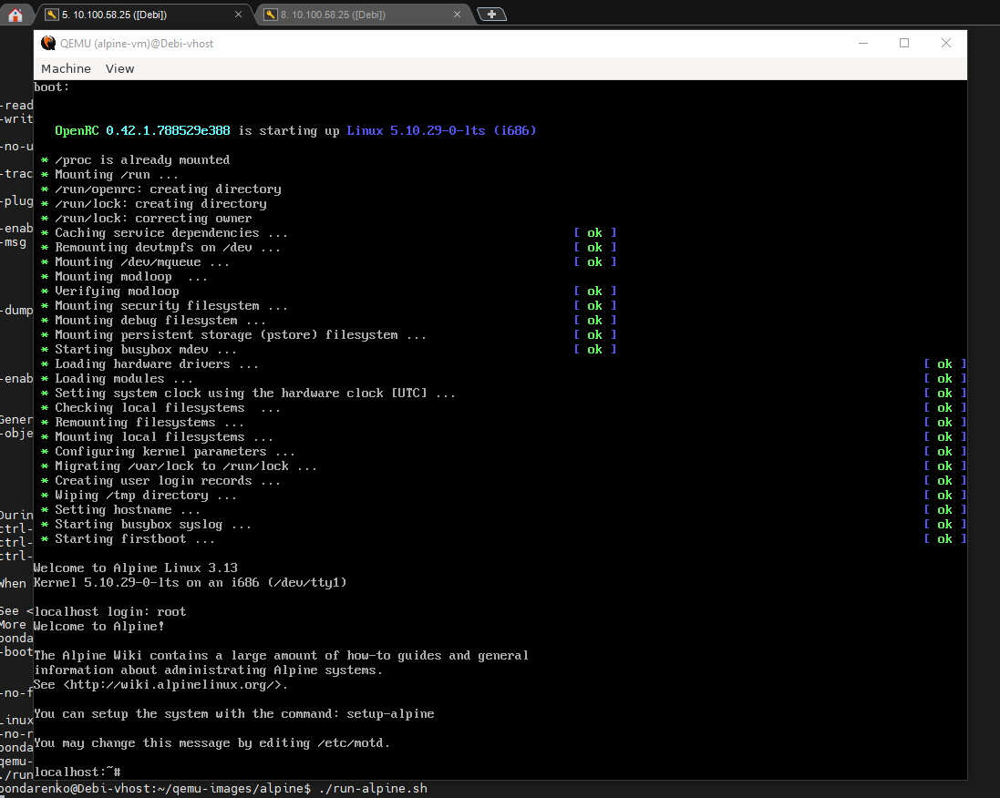
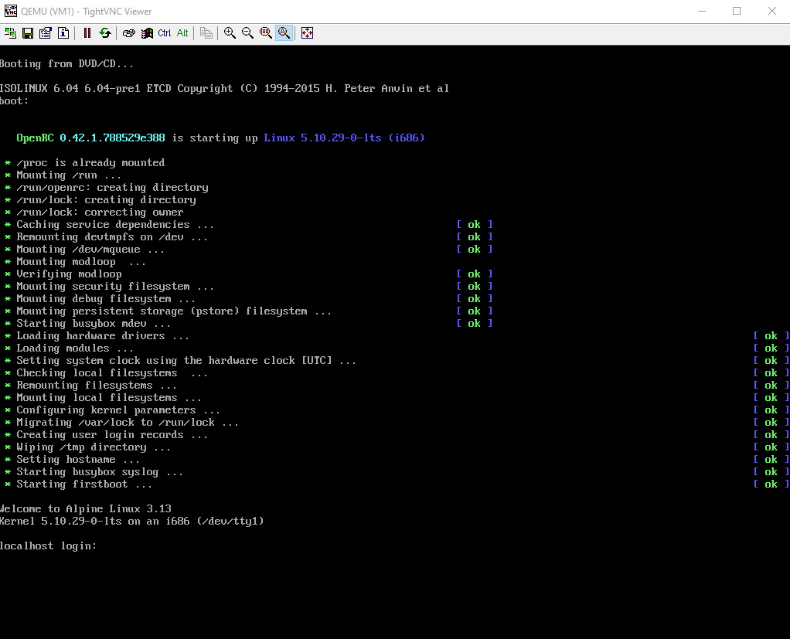
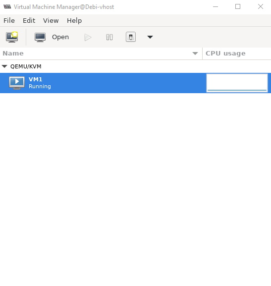
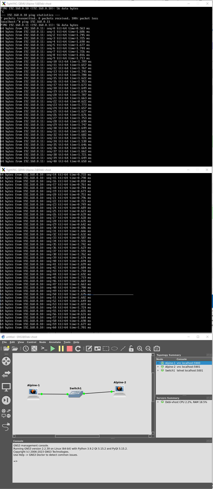

# Домашнее задание к занятию «Типы виртуализации: KVM, QEMU»

## Задание 2


```shell
bondarenko@Debi-vhost:~/qemu-images$ qemu-img create -f qcow2 alpine.img 8G
Formatting 'alpine.img', fmt=qcow2 cluster_size=65536 extended_l2=off compression_type=zlib size=8589934592 lazy_refcounts=off refcount_bits=16
bondarenko@Debi-vhost:~/qemu-images/alpine$ nano run-alpine.sh
bondarenko@Debi-vhost:~/qemu-images/alpine$ chmod +x run-alpine.sh
bondarenko@Debi-vhost:~/qemu-images/alpine$ ./run-alpine.sh

```

*run-alpine.sh*

```shell
#!/bin/bash

qemu-system-x86_64 \
-m 2048 \
-smp cores=4 \
-cdrom ~/_iso/alpine-standard-3.13.5-x86.iso \
-hda alpine.img \
-boot d \
-net nic \
-net user \
-name alpine-vm

```
*Скриншот запуска*



## Задание 3

**Настройка interfaces**

```shell
# This file describes the network interfaces available on your system
# and how to activate them. For more information, see interfaces(5).

source /etc/network/interfaces.d/*

# The loopback network interface
auto lo
iface lo inet loopback

auto br0
iface br0 inet dhcp
        bridge_ports enp2s0

```

**Скрипт создания VM**

```shell
#!/bin/bash

virt-install -n VM1 \
--check path_in_use=off \
--autostart \
--noautoconsole \
--network=bridge:br0 \
--ram 2048 --arch=x86_64 \
--vcpus=2 --cpu host --check-cpu \
--disk path=/kvm/vhdd/vm-kvm-disk1.img,size=8 \
--cdrom ~bondarenko/_iso/alpine-standard-3.13.5-x86.iso \
--graphics vnc,listen=0.0.0.0,password=vnc_password \
--os-type linux --os-variant=alpinelinux3.13 --boot cdrom,hd,menu=on

```


**Запуск VM**

```shell
bondarenko@Debi-vhost:/kvm/run-scripts$ sudo virsh start VM1
Domain 'VM1' started
```
***для повторного запуска пришлось дописать в xml путь к iso***

```shell
<disk type='file' device='cdrom'>
      <driver name='qemu' type='raw'/>
      <source file='/home/bondarenko/_iso/alpine-standard-3.13.5-x86.iso'/>
      <target dev='hdb' bus='ide'/>
      <readonly/>
      <address type='drive' controller='0' bus='0' target='0' unit='1'/>
</disk>
```

**Скриншот запущеной VM**



**Скриншот virt-manager**



## Задание 4

На скриншоте отображена требуемая топология с доступностью устройств.



## *Задание 5

