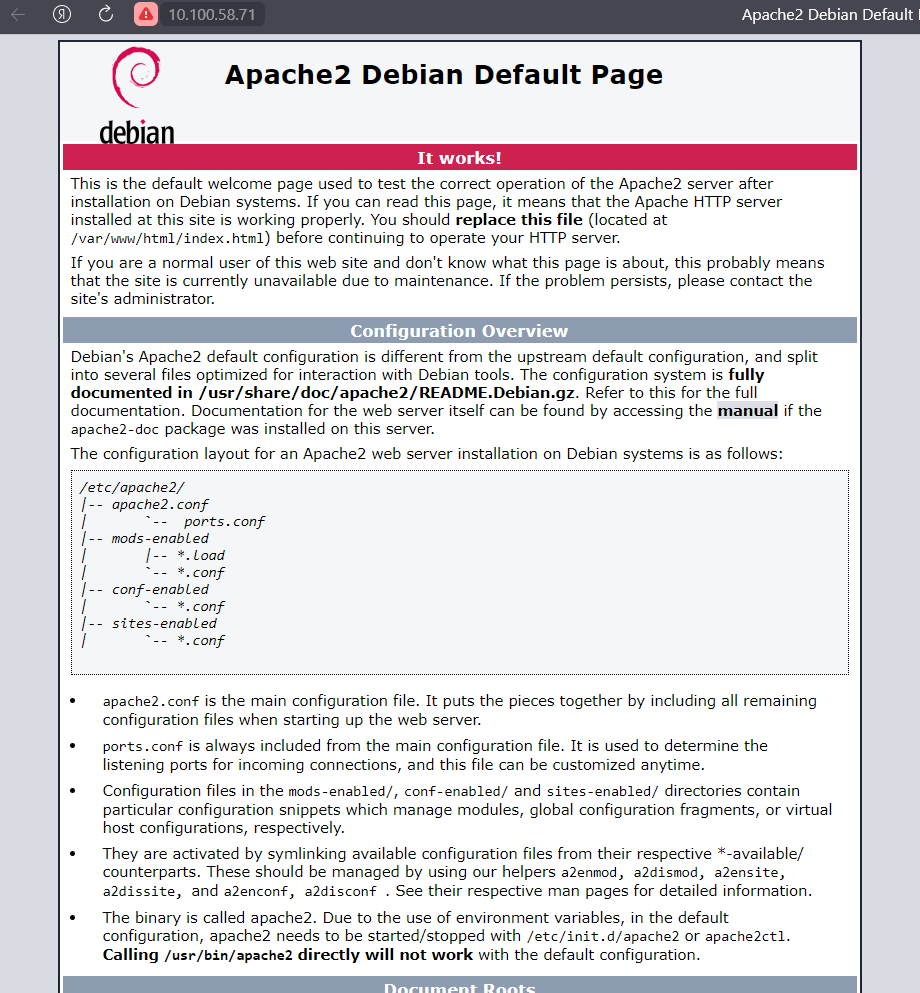

# Домашнее задание к занятию «Docker. Часть 1»

## Задание 1

Чем контейнеризация отличается от виртуализации?

    Виртуализация - это полное эмулирование реального устройства с системой и устройствами.
    Контейнеризация - это изоляция окружения для запускаемых программ.

## Задание 2
Выполните действия:

Установите Docker.

Приложите скриншот.

### Ответ


## Задание 3
Выполните действия:

Запустите образ hello-world.

Приложите скриншот.

### Ответ


## Задание 4
Выполните действия:

Удалите образ hello-world. 

Приложите скриншот.

### Ответ


## Задание 5

Найдите в Docker Hub образ apache и установите его.

Приложите:

скриншоты сетевых настроек вашей виртуальной машины;

скриншоты работающих контейнеров;

скриншот браузера, где вы открыли дефолтную страницу вашего apache внутри контейнера.

### Ответ
*Сетевый настройки*


&nbsp;

*Запущенный контейнер*


&nbsp;

*Скриншот страницы apache*



## Задание 6
Создайте свой Docker образ с Apache2 и подмените стандартную страницу index.html на страницу, содержащую ваши ФИО.

Приложите:

скриншот содержимого Dockerfile;

скриншот браузера, где apache2 из вашего контейнера выводит ваши ФИО.


### Ответ
*Dockerfile*
```shell
FROM debian:11

MAINTAINER bondarenko

LABEL version="1.1"

RUN DEBIAN_FRONTEND="noninteractive" apt update && apt install -y apache2 nano locales && locale-gen ru_RU.UTF-8 && echo AddDefaultCharset utf-8 >> /etc/apache2/apache2.conf
# Locale
RUN sed -i -e \
  's/# ru_RU.UTF-8 UTF-8/ru_RU.UTF-8 UTF-8/' /etc/locale.gen \
   && locale-gen

ENV LANG ru_RU.UTF-8
ENV LANGUAGE ru_RU:ru
ENV LC_LANG ru_RU.UTF-8
ENV LC_ALL ru_RU.UTF-8


COPY ./index.html /var/www/html/index.html

EXPOSE 80/tcp

CMD apachectl -D FOREGROUND
```

Скриншот index.html

