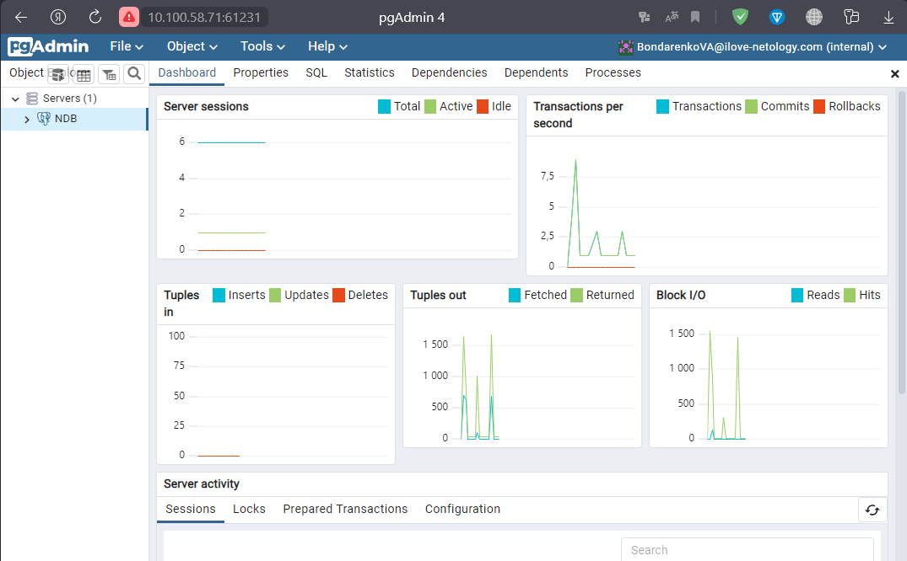
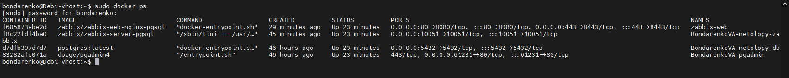
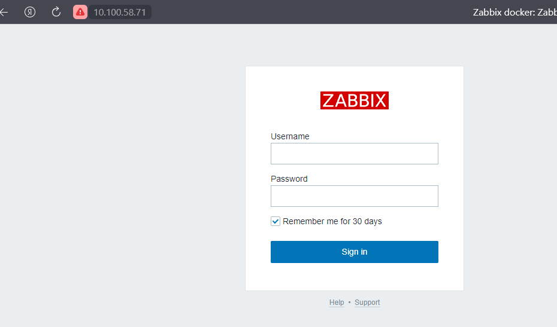

# Домашнее задание к занятию «Docker. Часть 2»

## Задание 1

```
Docker Compose позволяет сразу описать проект. Очередность запуска и настройки для каждого контейнера.
```

## Задание 2


## Задание 3


## Задание 4

*Текст конфига*

```shell
version: "3"
services:

  netology-db:
    image: postgres:latest
    container_name: BondarenkoVA-netology-db
    restart: always
    ports:
      - "5432:5432"
    volumes:
      - ./pg_data:/var/lib/postgresql/data/pgdata
    environment:
      POSTGRES_PASSWORD: BondarenkoVA12!3!!
      POSTGRES_USER: postgres
      POSTGRES_DB: BondarenkoVA-netology_db
      POSTGRES_INITDB_ARGS: --auth-host=scram-sha-256
      PGDATA: /var/lib/postgresql/data/pgdata 
    networks:
      BondarenkoVA-my-netology-hw:
        ipv4_address: 172.22.0.2

  pgadmin:
    image: dpage/pgadmin4
    container_name: BondarenkoVA-pgadmin
    environment:
      PGADMIN_DEFAULT_EMAIL: BondarenkoVA@ilove-netology.com
      PGADMIN_DEFAULT_PASSWORD: 123
    ports:
      - "61231:80"
    networks:
      BondarenkoVA-my-netology-hw:
        ipv4_address: 172.22.0.3
    restart: always

networks:
  BondarenkoVA-my-netology-hw:
    driver: bridge
    ipam:
      config:
        - subnet: 172.22.0.0/24
```
*Скрин админки pdAdmin*




## Задание 5


## Задание 6

## Задание 7
*текст конфига*

```shell
version: "3"
services:

  netology-db:
    image: postgres:latest
    container_name: BondarenkoVA-netology-db
    restart: always
    ports:
      - "5432:5432"
    volumes:
      - ./pg_data:/var/lib/postgresql/data/pgdata
    environment:
      POSTGRES_PASSWORD: BondarenkoVA12!3!!
      POSTGRES_USER: postgres
      POSTGRES_DB: BondarenkoVA-netology_db
      POSTGRES_INITDB_ARGS: --auth-host=scram-sha-256
      PGDATA: /var/lib/postgresql/data/pgdata 
    networks:
      BondarenkoVA-my-netology-hw:
        ipv4_address: 172.22.0.2

  pgadmin:
    image: dpage/pgadmin4
    container_name: BondarenkoVA-pgadmin
    environment:
      PGADMIN_DEFAULT_EMAIL: BondarenkoVA@ilove-netology.com
      PGADMIN_DEFAULT_PASSWORD: 123
    ports:
      - "61231:80"
    networks:
      BondarenkoVA-my-netology-hw:
        ipv4_address: 172.22.0.3
    restart: always

  zabbix-server:
    image: zabbix/zabbix-server-pgsql
    links:
      - netology-db
    container_name: BondarenkoVA-netology-zabbix
    environment:
      DB_SERVER_HOST: '172.22.0.2'
      POSTGRES_USER: postgres
      POSTGRES_PASSWORD: BondarenkoVA12!3!!
    ports:
      - "10051:10051"
    networks:
      BondarenkoVA-my-netology-hw:
        ipv4_address: 172.22.0.4
    restart: always
    depends_on:
      - netology-db
      
      
  zabbix-web:
    image: zabbix/zabbix-web-nginx-pgsql
    container_name: zabbix-web
    hostname: zabbix-web
    restart: always
    environment:
      DB_SERVER_HOST: netology-db
      POSTGRES_USER: postgres
      POSTGRES_PASSWORD: BondarenkoVA12!3!!
      ZBX_SERVER_HOST: zabbix-server
      PHP_TZ: "Europe/Moscow"
    ports:
      - 80:8080
      - 443:8443
    networks:
      BondarenkoVA-my-netology-hw:
        ipv4_address: 172.22.0.5
    depends_on:
      - netology-db
      - zabbix-server

networks:
  BondarenkoVA-my-netology-hw:
    driver: bridge
    ipam:
      config:
        - subnet: 172.22.0.0/24
```
*скрин docker ps*



*скрин входа в zabbix*



## Задание 8

```shell
bondarenko@Debi-vhost:~$ cd docker-compose/
bondarenko@Debi-vhost:~/docker-compose$ sudo docker-compose kill
Killing zabbix-web                   ... done
Killing BondarenkoVA-netology-zabbix ... done
Killing BondarenkoVA-netology-db     ... done
Killing BondarenkoVA-pgadmin         ... done
bondarenko@Debi-vhost:~/docker-compose$ sudo docker ps
CONTAINER ID   IMAGE     COMMAND   CREATED   STATUS    PORTS     NAMES
bondarenko@Debi-vhost:~/docker-compose$ sudo docker images
REPOSITORY                      TAG       IMAGE ID       CREATED       SIZE
apachetest                      1.1       f09201411710   3 days ago    279MB
apachetest                      1.0       4a51637bd51c   3 days ago    255MB
zabbix/zabbix-web-nginx-pgsql   latest    c72839120082   8 days ago    213MB
zabbix/zabbix-web-nginx-mysql   latest    5317371547c6   8 days ago    242MB
zabbix/zabbix-server-pgsql      latest    eb828fa23665   8 days ago    57.9MB
postgres                        latest    f14b0d96cff9   11 days ago   379MB
dpage/pgadmin4                  latest    03adfa2b5a55   2 weeks ago   491MB
bondarenko@Debi-vhost:~/docker-compose$ sudo docker-compose rm
Going to remove zabbix-web, BondarenkoVA-netology-zabbix, BondarenkoVA-netology-db, BondarenkoVA-pgadmin
Are you sure? [yN] y
Removing zabbix-web                   ... done
Removing BondarenkoVA-netology-zabbix ... done
Removing BondarenkoVA-netology-db     ... done
Removing BondarenkoVA-pgadmin         ... done

```

## Задание 9

Сколько ушло времени на то, чтобы развернуть на чистом железе написанный вами сценарий?

```
Запуск сценария с нуля занял приблизительно 40 секунд
```

Чем вы занимались в процессе создания сценария так, как это видите вы?
```
Мы описывали состав, конфигурацию и взаимодействие запускаемых контейнеров
```

Что бы вы улучшили в сценарии развёртывания?
```
Добавил возможность автоматической пересборки определенных контейнеров при изменении конфигурации
```