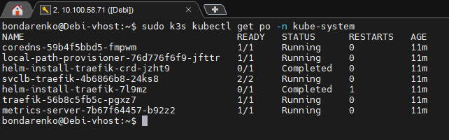

# Домашнее задание к занятию «Kubernetes. Часть 1»

## Задание 1

**Выполните действия:**

1. Запустите Kubernetes локально, используя k3s или minikube на свой выбор.
2. Добейтесь стабильной работы всех системных контейнеров.
3. В качестве ответа пришлите скриншот результата выполнения команды kubectl get po -n kube-system.


*Скриншот*



## Задание 2

**Выполните действия:**

1. Измените файл с учётом условий:

 * redis должен запускаться без пароля;
 * создайте Service, который будет направлять трафик на этот Deployment;
 * версия образа redis должна быть зафиксирована на 6.0.13.

2. Запустите Deployment в своём кластере и добейтесь его стабильной работы.
3. В качестве решения пришлите получившийся файл.

 ### *Решение*

```yaml
---
apiVersion: apps/v1
kind: Deployment
metadata:
  name: redis
spec:
  selector:
    matchLabels:
      app: redis
  replicas: 1
  template:
    metadata:
      labels:
        app: redis
    spec:
      containers:
      - name: master
        image: bitnami/redis:6.0.13
        env:
         - name: ALLOW_EMPTY_PASSWORD
           value: "yes"
        ports:
        - containerPort: 6379

---
apiVersion: v1
kind: Service
metadata:
  name: redis-service
spec:
  selector:
    app: redis
  type: LoadBalancer
  ports:
  - protocol: TCP
    port: 6379
    targetPort: 6379

```

## Задание 3


### *Решение*

```shell
sudo k3s kubectl exec -it redis-58c6d4947b-vj6rp -- bash -c "ps aux"
================
sudo k3s kubectl logs deployment/redis --since=5m
================
bondarenko@Debi-vhost:~$ sudo k3s kubectl delete deployment/redis
deployment.apps "redis" deleted
================
sudo kubectl port-forward deployment/redis 6379:6379

```

## Задание 4*

Есть конфигурация nginx:

```
location / {
    add_header Content-Type text/plain;
    return 200 'Hello from k8s';
}
```

**Выполните действия:**

1. Напишите yaml-файлы для развёртки nginx, в которых будут присутствовать:

 - ConfigMap с конфигом nginx;
 - Deployment, который бы подключал этот configmap;
 - Ingress, который будет направлять запросы по префиксу /test на наш сервис.

2. В качестве решения пришлите получившийся файл.


### *Решение*

```yaml
---
apiVersion: v1
kind: ConfigMap
metadata:
  name: nginx-config
  labels:
    app: nginx
data:
  nginx-location.conf: |
      server {
        location / {
          add_header Content-Type text/plain;
          return 200 'Hello from k8s';
        }
      }
---
apiVersion: apps/v1
kind: Deployment
metadata:
  name: nginx-deployment
spec:
  replicas: 1
  selector:
    matchLabels:
      app: nginx
  template:
    metadata:
      labels:
        app: nginx
    spec:
      containers:
        - name: nginx
          image: nginx:1.25.0
          ports:
            - containerPort: 80
              name: nginx-port
          volumeMounts:
            - name: nginx-config
              mountPath: /etc/nginx/conf.d/nginx-location.conf
              subPath: nginx-location.conf
      volumes:
        - name: nginx-config
          configMap:
            name: nginx-config

---
apiVersion: v1
kind: Service
metadata:
  name: nginx-service
  labels:
    app: nginx-service
spec:
  selector:
    app: nginx
  type: NodePort
  ports:
    - protocol: TCP
      port: 80
      targetPort: 80


---
apiVersion: networking.k8s.io/v1
kind: Ingress
metadata:
  name: nginx-ingress
spec:
  rules:
    - http:
        paths:
          - path: /test
            pathType: Prefix
            backend:
              service:
                name: nginx-service
                port:
                  number: 80

```