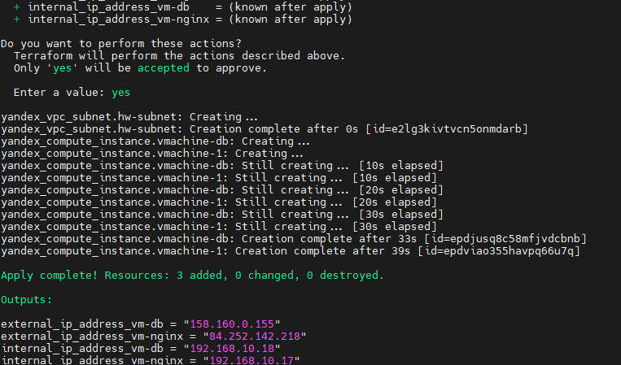
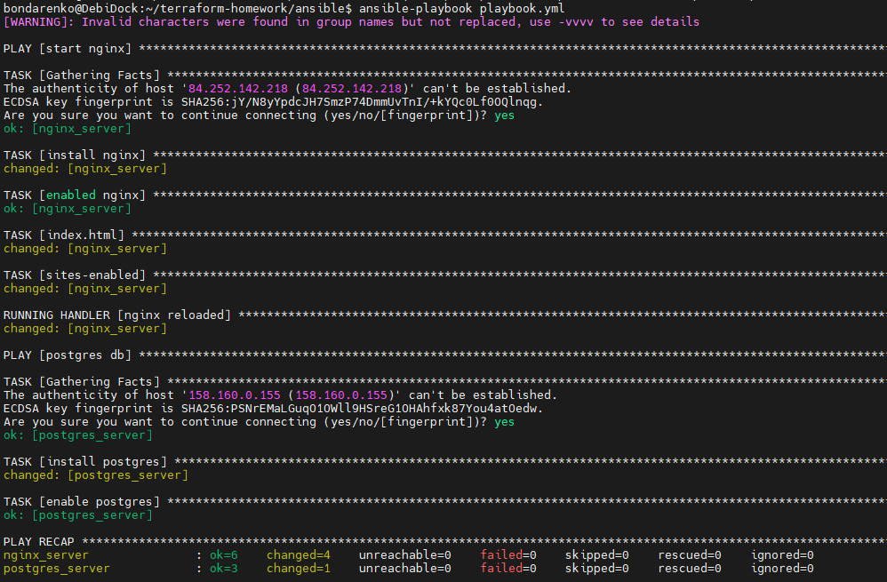
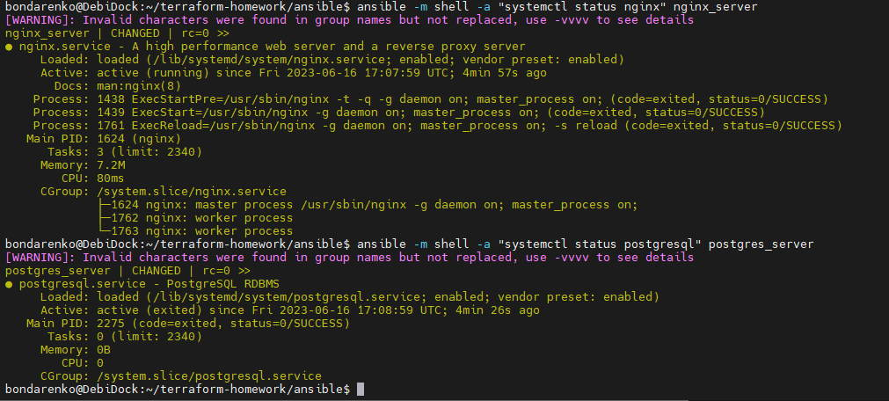

# Домашнее задание к занятию «Подъём инфраструктуры в Yandex Cloud»

### Задание 1 + 2

**Выполните действия, приложите скриншот скриптов, скриншот выполненного проекта.**

От заказчика получено задание: при помощи Terraform и Ansible собрать виртуальную инфраструктуру и развернуть на ней веб-ресурс. 

В инфраструктуре нужна одна машина с ПО ОС Linux, двумя ядрами и двумя гигабайтами оперативной памяти. 

Требуется установить nginx, залить при помощи Ansible конфигурационные файлы nginx и веб-ресурса. 

### *Ответ*

main.tf
```yml
terraform {
  required_providers {
    yandex = {
      source = "yandex-cloud/yandex"
    }
  }
  required_version = ">= 0.13"
}

provider "yandex" {
  token = "y0_AgAAAAAA6WJqAATuwQAAAADlZPNddz6fNhTeS8CmlQAIwvsds_N6jbM"
  cloud_id = "b1g6lqgummp0f6chmuj5"
  folder_id = "b1g314opt7d3ef23cdo5"
  zone = "ru-central1-b"
}

resource "yandex_compute_instance" "vmachine-1" {
  name = "vm-nginx"

  resources {
    core_fraction = 20
    cores  = 2
    memory = 2
  }

  network_interface {
    subnet_id = yandex_vpc_subnet.hw-subnet.id
    nat       = true
  }

  boot_disk {
    initialize_params {
      image_id = "fd80eup4e4h7mmodr9d4"
    }
  }
  
  metadata = {
    user-data = "${file("./meta.txt")}"
  }

}

resource "yandex_compute_instance" "vmachine-db" {
  name = "vm-db"

  resources{
    core_fraction = 20
    cores  = 2
    memory = 2    
  }

  network_interface {
    subnet_id = yandex_vpc_subnet.hw-subnet.id
    nat       = true    
  }

  boot_disk {
    initialize_params {
      image_id = "fd80eup4e4h7mmodr9d4"    
    }
  }
  
  metadata = {
    user-data = "${file("./meta.txt")}"
  }

}

resource "yandex_vpc_subnet" "hw-subnet" {
  name           = "hw-subnet"
  zone           = "ru-central1-b"
  network_id     = "enpmu4bftnfuhpj92ibb"
  v4_cidr_blocks = ["192.168.10.0/24"]
}

output "internal_ip_address_vm-nginx" {
  value = yandex_compute_instance.vmachine-1.network_interface.0.ip_address
}
output "external_ip_address_vm-nginx" {
  value = yandex_compute_instance.vmachine-1.network_interface.0.nat_ip_address
}
output "internal_ip_address_vm-db" {
  value = yandex_compute_instance.vmachine-db.network_interface.0.ip_address
}
output "external_ip_address_vm-db" {
  value = yandex_compute_instance.vmachine-db.network_interface.0.nat_ip_address
}
```


playbook.yml
```yaml
---
- name: start nginx
  hosts: nginx-vm
  remote_user: bondarenko
  become: true
  become_method: sudo
  gather_facts: yes

  tasks:
    - name: install nginx
      apt:
        update_cache: yes
        name: nginx
        state: present

    - name: enabled nginx
      systemd:
        name: nginx 
        state: started
        enabled: yes

    - name: index.html
      template:
        src: ./files/index.html 
        dest: /var/www/html/index.html 
        output_encoding: utf-8
        force: yes
      notify: nginx reloaded

    - name: sites-enabled
      template:
        src: ./files/hwyandexcloud.conf 
        dest: /etc/nginx/sites-enabled/hwyandexcloud.conf
        force: yes
      notify: nginx reloaded

  handlers:
    - name: nginx reloaded
      systemd:
        name: nginx 
        state: reloaded

- name: postgres db
  hosts: postgres-vm
  remote_user: bondarenko
  become: true
  become_method: sudo
  gather_facts: yes

  tasks:
    - name: install postgres
      apt:
        update_cache: yes
        name: postgresql
        state: present

    - name: enable postgres
      systemd:
        name: postgresql 
        state: started 
        enabled: yes 

```

Screenshot terraform apply



Screenshot ansible-playbook playbook.yml



Testing services

