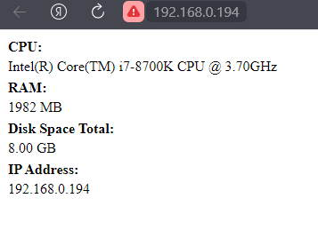

# Домашнее задание к занятию «Ansible.Часть 2»

## Задание 1

**Выполните действия, приложите файлы с плейбуками и вывод выполнения.**

Напишите три плейбука. При написании рекомендуем использовать текстовый редактор с подсветкой синтаксиса YAML.

Плейбуки должны: 

1. Скачать какой-либо архив, создать папку для распаковки и распаковать скаченный архив. Например, можете использовать [официальный сайт](https://kafka.apache.org/downloads) и зеркало Apache Kafka. При этом можно скачать как исходный код, так и бинарные файлы, запакованные в архив — в нашем задании не принципиально.
2. Установить пакет tuned из стандартного репозитория вашей ОС. Запустить его, как демон — конфигурационный файл systemd появится автоматически при установке. Добавить tuned в автозагрузку.
3. Изменить приветствие системы (motd) при входе на любое другое. Пожалуйста, в этом задании используйте переменную для задания приветствия. Переменную можно задавать любым удобным способом.


### *Ответ*

1.
```yaml
---
- name: Download and extract files
  hosts: vmachines
  become: true
  become_method: sudo
  
  tasks:
    - name: Download archive
      get_url:
        url: "https://downloads.apache.org/kafka/3.4.0/kafka-3.4.0-src.tgz"
        dest: "/tmp/kafka-3.4.0-src.tgz"
    
    - name: Create directory
      file:
        path: "/tmp/extracted"
        state: directory

    - name: Разархивировать архив
      unarchive:
        remote_src: yes
        src: "/tmp/kafka-3.4.0-src.tgz"
        dest: "/tmp/extracted"
```
```shell
bondarenko@DebiDock:~/ansible$ ansible-playbook -b --become-password-file ./sudo-pass ansible-playbook.yml

PLAY [Download and extract files] *********************************************************************************************************************

TASK [Gathering Facts] ********************************************************************************************************************************
ok: [192.168.0.136]
ok: [192.168.0.194]

TASK [Download archive] *******************************************************************************************************************************
ok: [192.168.0.136]
ok: [192.168.0.194]

TASK [Create directory] *******************************************************************************************************************************
ok: [192.168.0.136]
ok: [192.168.0.194]

TASK [Разархивировать архив] **************************************************************************************************************************
ok: [192.168.0.136]
ok: [192.168.0.194]

PLAY RECAP ********************************************************************************************************************************************
192.168.0.136              : ok=4    changed=0    unreachable=0    failed=0    skipped=0    rescued=0    ignored=0
192.168.0.194              : ok=4    changed=0    unreachable=0    failed=0    skipped=0    rescued=0    ignored=0

```

2.
```yaml
---
- name: Install Tuned and enabled
  hosts: vmachines
  become: true
  become_method: sudo
  
  tasks:
    - name: install tuned
      apt:
        name: tuned
        state: present

    - name: run and enable tuned
      service:
        name: tuned
        state: started
        enabled: yes
```
```shell
bondarenko@DebiDock:~/ansible$ ansible-playbook -b --become-password-file ./sudo-pass ansible-tuned.yml

PLAY [Install Tuned and enabled] **********************************************************************************************************************

TASK [Gathering Facts] ********************************************************************************************************************************
ok: [192.168.0.194]
ok: [192.168.0.136]

TASK [install tuned] **********************************************************************************************************************************
ok: [192.168.0.194]
ok: [192.168.0.136]

TASK [run and enable tuned] ***************************************************************************************************************************
ok: [192.168.0.194]
ok: [192.168.0.136]

PLAY RECAP ********************************************************************************************************************************************
192.168.0.136              : ok=3    changed=0    unreachable=0    failed=0    skipped=0    rescued=0    ignored=0
192.168.0.194              : ok=3    changed=0    unreachable=0    failed=0    skipped=0    rescued=0    ignored=0
```


3.
```yaml
---
- name: Edit motd # Изменить приветствие при подключении к ноде
  hosts: vmachines
  become: true
  become_method: sudo

  tasks:
    - name: Load variables
      include_vars:
        file: ./vars.yml

    - name: Change motd with variable # Заменить приветствие с использованием переменной
      template:
        src: ./motd.txt
        dest: /etc/motd
```
*vars.yml*
```yaml
---
motd:
  name: Vitaly
  class: SYS-21
```
*motd.txt*
```
Hey there!
This is custom message of the day text.
Lets put here some variables:

var1: {{ motd.name }}
var2: {{ motd.class }}
```


```shell
bondarenko@DebiDock:~/ansible$ ansible-playbook -b --become-password-file ./sudo-pass ansible-motd.yml

PLAY [Edit motd] **************************************************************************************************************************************

TASK [Gathering Facts] ********************************************************************************************************************************
ok: [192.168.0.194]
ok: [192.168.0.136]

TASK [Load variables] *********************************************************************************************************************************
ok: [192.168.0.194]
ok: [192.168.0.136]

TASK [Change motd with variable] **********************************************************************************************************************
changed: [192.168.0.194]
changed: [192.168.0.136]

PLAY RECAP ********************************************************************************************************************************************
192.168.0.136              : ok=3    changed=1    unreachable=0    failed=0    skipped=0    rescued=0    ignored=0
192.168.0.194              : ok=3    changed=1    unreachable=0    failed=0    skipped=0    rescued=0    ignored=0
```

```shell
bondarenko@debian-snet-1:~$ cat /etc/motd

The programs included with the Debian GNU/Linux system are free software;
the exact distribution terms for each program are described in the
individual files in /usr/share/doc/*/copyright.

Debian GNU/Linux comes with ABSOLUTELY NO WARRANTY, to the extent
permitted by applicable law.
bondarenko@debian-snet-1:~$ cat /etc/motd
Hey there!
This is custom message of the day text.
Lets put here some variables:

var1: Vitaly
var2: SYS-21
bondarenko@debian-snet-1:~$
```

## Задание 2

**Выполните действия, приложите файлы с модифицированным плейбуком и вывод выполнения.** 

Модифицируйте плейбук из пункта 3, задания 1. В качестве приветствия он должен установить IP-адрес и hostname управляемого хоста, пожелание хорошего дня системному администратору.

### *Ответ*

*motd.txt*
```
Hey there, System Administator! Have a nice day!
You are connected to {{ ansible_default_ipv4.address }}
And HOSTNAME is {{ ansible_hostname }}

```

### Задание 3

**Выполните действия, приложите архив с ролью и вывод выполнения.**

Ознакомьтесь со статьёй [«Ansible - это вам не bash»](https://habr.com/ru/post/494738/), сделайте соответствующие выводы и не используйте модули **shell** или **command** при выполнении задания.

Создайте плейбук, который будет включать в себя одну, созданную вами роль. Роль должна:

1. Установить веб-сервер Apache на управляемые хосты.
2. Сконфигурировать файл index.html c выводом характеристик каждого компьютера как веб-страницу по умолчанию для Apache. Необходимо включить CPU, RAM, величину первого HDD, IP-адрес. Используйте [Ansible facts](https://docs.ansible.com/ansible/latest/playbook_guide/playbooks_vars_facts.html) и [jinja2-template](https://linuxways.net/centos/how-to-use-the-jinja2-template-in-ansible/)
3. Открыть порт 80, если необходимо, запустить сервер и добавить его в автозагрузку.
4. Сделать проверку доступности веб-сайта (ответ 200, модуль uri).

В качестве решения:
- предоставьте плейбук, использующий роль;
- разместите архив созданной роли у себя на Google диске и приложите ссылку на роль в своём решении;
- предоставьте скриншоты выполнения плейбука;
- предоставьте скриншот браузера, отображающего сконфигурированный index.html в качестве сайта.

### *Ответ*

Плейбук [Ссылка](./homework-7.2/ansible-apache.yml)

Архив роли [Ссылка](./homework-7.2/roles.tar.gz)

Скрин выполнения


Скрин браузера

git 