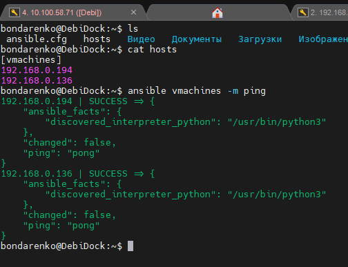
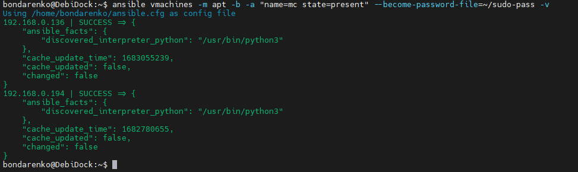
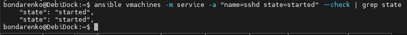
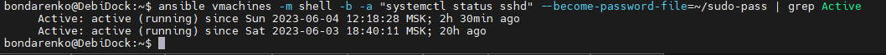
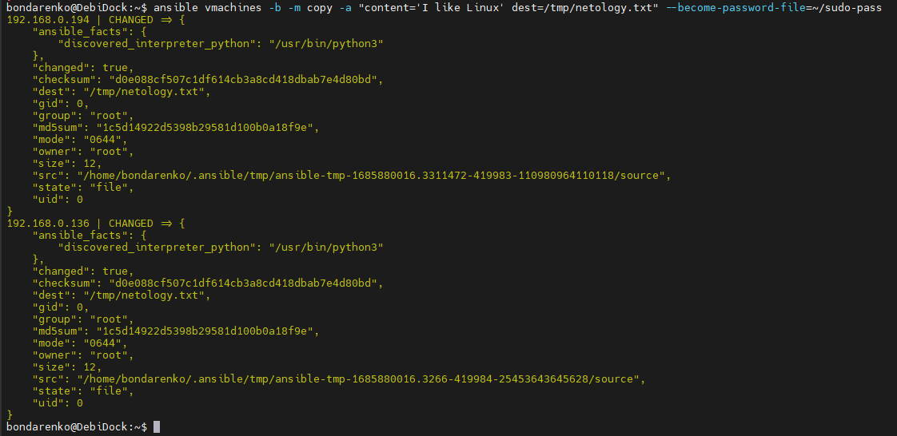
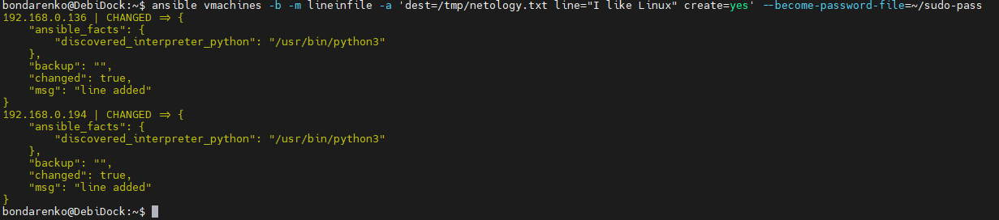

# Домашнее задание к занятию «Ansible. Часть 1»

## Задание 1

**Ответьте на вопрос в свободной форме.**

Какие преимущества даёт подход IAC?


### *Ответ*
```
Автоматизация и повторяемость: Используя IAC, инфраструктура может быть полностью автоматизирована и описана в виде кода. Это позволяет повторять и развертывать инфраструктуру с помощью инструментов автоматизации. Автоматизация снижает вероятность ошибок, связанных с ручным внесением изменений.

Масштабируемость: IAC позволяет легко масштабировать инфраструктуру. Инфраструктурный код может быть повторно использован и модифицирован для создания больших и сложных сред.

Управление версиями: Код инфраструктуры может быть сохранен в системе контроля версий (например, Git), что позволяет отслеживать и контролировать изменения в инфраструктуре. Это обеспечивает прозрачность и возможность отката к предыдущим версиям в случае проблем.
```

## Задание 2

**Выполните действия и приложите скриншоты действий.**

1. Установите Ansible.
2. Настройте управляемые виртуальные машины, не меньше двух.
3. Создайте файл inventory. Предлагается использовать файл, размещённый в папке с проектом, а не файл inventory по умолчанию.
4. Проверьте доступность хостов с помощью модуля ping.




## Задание 3 

**Ответьте на вопрос в свободной форме.**

Какая разница между параметрами forks и serial? 

### *Ответ*

```
forks - отвечает за количество одновременно выполняемых задач на хостах
serial - отвечает за количество хостов для одновременного запуска на них плейбука (чтобы не нагружать сеть , например)
```

## Задание 4 

В этом задании вы будете работать с Ad-hoc коммандами.

**Выполните действия и приложите скриншоты запуска команд.**

1. Установите на управляемых хостах любой пакет, которого нет.
2. Проверьте статус любого, присутствующего на управляемой машине, сервиса. 
3. Создайте файл с содержимым «I like Linux» по пути /tmp/netology.txt.


### *Ответ*

*Повторный вызов команды*


Проверил статус двумя способами




Файл можно создать такими способами


