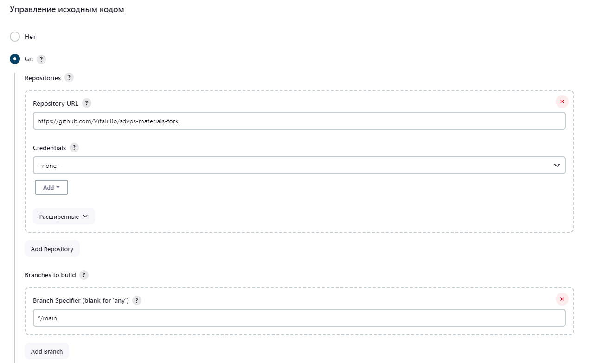
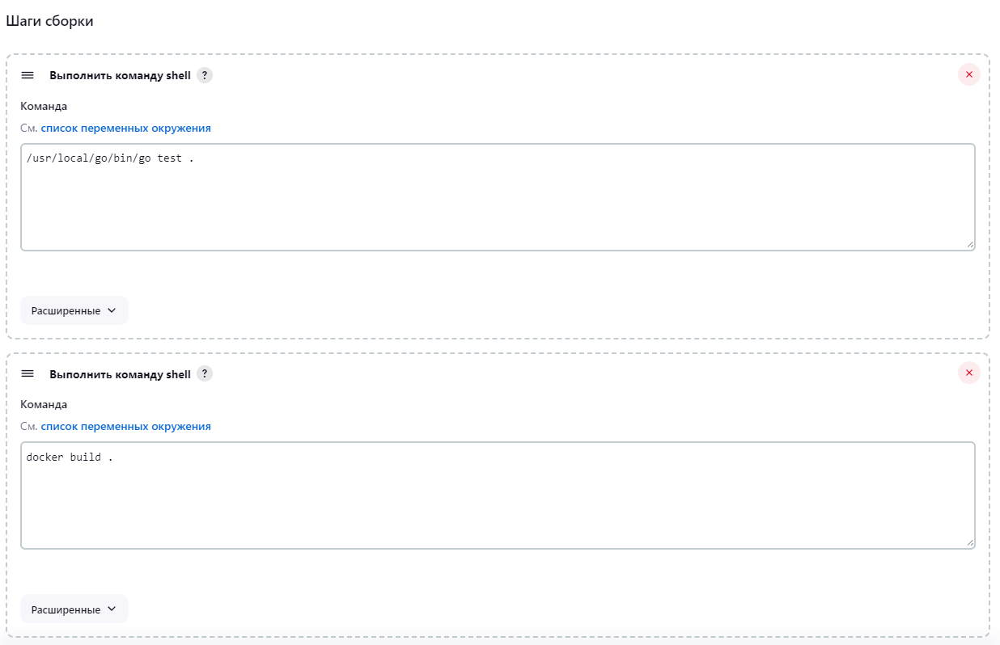
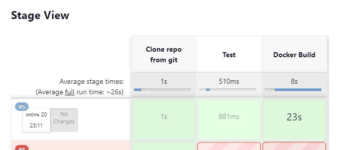

### Задание 1
**Что нужно сделать:**

1. Установите себе jenkins по инструкции из лекции или любым другим способом из официальной документации. Использовать Docker в этом задании нежелательно.
2. Установите на машину с jenkins [golang](https://golang.org/doc/install).
3. Используя свой аккаунт на GitHub, сделайте себе форк [репозитория](https://github.com/netology-code/sdvps-materials.git). В этом же репозитории находится [дополнительный материал для выполнения ДЗ](https://github.com/netology-code/sdvps-materials/blob/main/CICD/8.2-hw.md).
3. Создайте в jenkins Freestyle Project, подключите получившийся репозиторий к нему и произведите запуск тестов и сборку проекта ```go test .``` и  ```docker build .```.

В качестве ответа пришлите скриншоты с настройками проекта и результатами выполнения сборки.

### *Ответ*






```shell
Started by user Vitaly B
Running as SYSTEM
Building in workspace /var/lib/jenkins/workspace/MyFirstItem
The recommended git tool is: NONE
No credentials specified
 > git rev-parse --resolve-git-dir /var/lib/jenkins/workspace/MyFirstItem/.git # timeout=10
Fetching changes from the remote Git repository
 > git config remote.origin.url https://github.com/VitaliiBo/sdvps-materials-fork # timeout=10
Fetching upstream changes from https://github.com/VitaliiBo/sdvps-materials-fork
 > git --version # timeout=10
 > git --version # 'git version 2.30.2'
 > git fetch --tags --force --progress -- https://github.com/VitaliiBo/sdvps-materials-fork +refs/heads/*:refs/remotes/origin/* # timeout=10
 > git rev-parse refs/remotes/origin/main^{commit} # timeout=10
Checking out Revision 223dbc3f489784448004e020f2ef224f17a7b06d (refs/remotes/origin/main)
 > git config core.sparsecheckout # timeout=10
 > git checkout -f 223dbc3f489784448004e020f2ef224f17a7b06d # timeout=10
Commit message: "Update README.md"
 > git rev-list --no-walk 223dbc3f489784448004e020f2ef224f17a7b06d # timeout=10
[MyFirstItem] $ /bin/sh -xe /tmp/jenkins17493485355912984051.sh
+ /usr/local/go/bin/go test .
ok  	github.com/netology-code/sdvps-materials	(cached)
[MyFirstItem] $ /bin/sh -xe /tmp/jenkins1952993175701437388.sh
+ docker build .
#1 [internal] load .dockerignore
#1 transferring context: 2B done
#1 DONE 0.0s

#2 [internal] load build definition from Dockerfile
#2 transferring dockerfile: 350B 0.0s done
#2 DONE 0.1s

#3 [internal] load metadata for docker.io/library/golang:1.16
#3 DONE 1.1s

#4 [internal] load metadata for docker.io/library/alpine:latest
#4 DONE 1.2s

#5 [builder 1/4] FROM docker.io/library/golang:1.16@sha256:5f6a4662de3efc6d6bb812d02e9de3d8698eea16b8eb7281f03e6f3e8383018e
#5 DONE 0.0s

#6 [stage-1 1/3] FROM docker.io/library/alpine:latest@sha256:82d1e9d7ed48a7523bdebc18cf6290bdb97b82302a8a9c27d4fe885949ea94d1
#6 DONE 0.0s

#7 [internal] load build context
#7 transferring context: 13.19kB done
#7 DONE 0.0s

#8 [stage-1 2/3] RUN apk -U add ca-certificates
#8 CACHED

#9 [builder 4/4] RUN CGO_ENABLED=0 GOOS=linux go build -a -installsuffix nocgo -o /app .
#9 CACHED

#10 [builder 3/4] COPY . ./
#10 CACHED

#11 [builder 2/4] WORKDIR /go/src/github.com/netology-code/sdvps-materials
#11 CACHED

#12 [stage-1 3/3] COPY --from=builder /app /app
#12 CACHED

#13 exporting to image
#13 exporting layers done
#13 writing image sha256:a0ff24894ec8229eb4ee717e5ad1bbe8b4bf86c76edc7c213c6ea96102bc89dc done
#13 DONE 0.0s
Finished: SUCCESS
```


### Задание 2
**Что нужно сделать:**

1. Создайте новый проект pipeline.
2. Перепишите сборку из задания 1 на declarative в виде кода.

В качестве ответа пришлите скриншоты с настройками проекта и результатами выполнения сборки.

### *Ответ*

```
pipeline{
    agent any
    stages{
        stage('Clone repo from git') {
            steps {
                //Get repo from git
                git branch: 'main', url: 'https://github.com/VitaliiBo/sdvps-materials-fork.git'
            }
        }
        stage('Test') {
            steps {
                //Runs shell command
                sh '/usr/local/go/bin/go test .'
            }
        }
        stage('Docker Build') {
            steps {
                sh 'docker build .'
            }
        }
    }
}
```



### Задание 3\4*

**Что нужно сделать:**

1. Установите на машину Nexus.
1. Создайте raw-hosted репозиторий.
1. Измените pipeline так, чтобы вместо Docker-образа собирался бинарный go-файл. Команду можно скопировать из Dockerfile.
1. Загрузите файл в репозиторий с помощью jenkins.

*Придумайте способ версионировать приложение, чтобы каждый следующий запуск сборки присваивал имени файла новую версию. Таким образом, в репозитории Nexus будет храниться история релизов.

В качестве ответа пришлите скриншоты с настройками проекта и результатами выполнения сборки.

### *Ответ*

```js
pipeline{
    agent any
    stages{
        stage('Clone repo from git') {
            steps {
                //Get repo from git
                git branch: 'main', url: 'https://github.com/VitaliiBo/sdvps-materials-fork.git'
            }
        }
        stage('Test') {
            steps {
                //Runs shell command
                sh '/usr/local/go/bin/go test .'
            }
        }
        stage('Go build') {
            steps {
                //Runs build command
            sh 'CGO_ENABLED=0 GOOS=linux /usr/local/go/bin/go build -a -installsuffix nocgo -o /app/goapp_build-v$BUILD_NUMBER .'
            }
        }
        stage('Upload build') {
            steps {
                //Upload file by cURL
            sh 'curl -u admin:admin --upload-file /app/goapp_build-v$BUILD_NUMBER "http://localhost:8081/repository/hw-repo/"'
            }
        }
    }
}

```