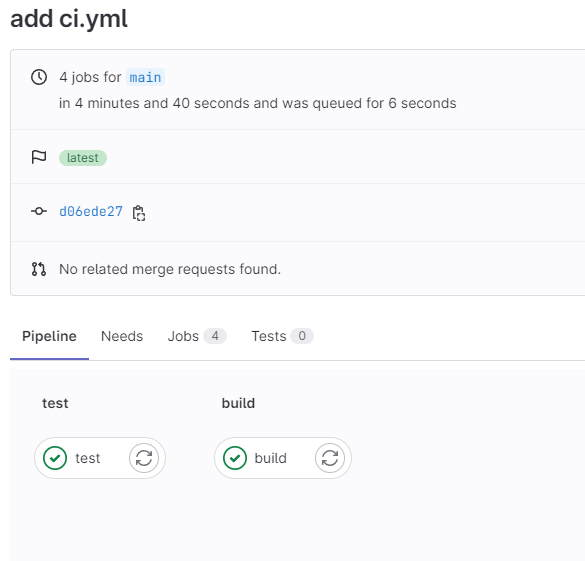
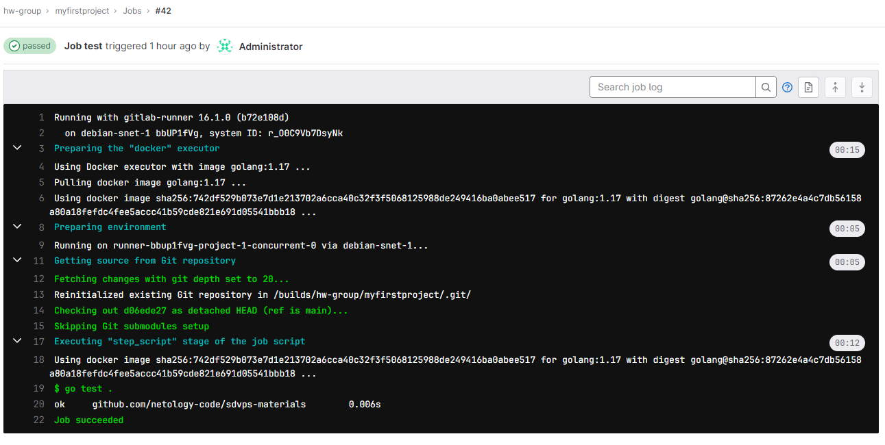
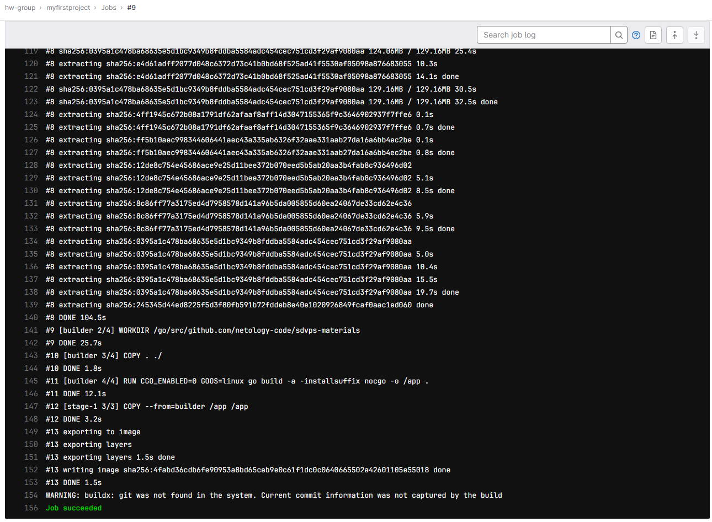

# Домашнее задание к занятию «GitLab»

### Задание 1

**Что нужно сделать:**

1. Разверните GitLab локально, используя Vagrantfile и инструкцию, описанные в [этом репозитории](https://github.com/netology-code/sdvps-materials/tree/main/gitlab).   
2. Создайте новый проект и пустой репозиторий в нём.
3. Зарегистрируйте gitlab-runner для этого проекта и запустите его в режиме Docker. Раннер можно регистрировать и запускать на той же виртуальной машине, на которой запущен GitLab.

В качестве ответа в репозиторий шаблона с решением добавьте скриншоты с настройками раннера в проекте.

### *Ответ*

```yaml
concurrent = 1
check_interval = 0
shutdown_timeout = 0

[session_server]
  session_timeout = 1800

[[runners]]
  name = "debian-snet-1"
  url = "http://192.168.0.145/"
  id = 1
  token = "bbUP1fVgekEQRrTwUdFs"
  token_obtained_at = 2023-06-25T19:12:26Z
  token_expires_at = 0001-01-01T00:00:00Z
  executor = "docker"
  [runners.cache]
    MaxUploadedArchiveSize = 0
  [runners.docker]
    tls_verify = false
    image = "go:1.17"
    privileged = false
    disable_entrypoint_overwrite = false
    oom_kill_disable = false
    disable_cache = false
    volumes = ["/cache", "/var/run/docker.sock:/var/run/docker.sock"]
#   volumes = ["/cache"]
    shm_size = 0

```

### Задание 2

**Что нужно сделать:**

1. Запушьте [репозиторий](https://github.com/netology-code/sdvps-materials/tree/main/gitlab) на GitLab, изменив origin. Это изучалось на занятии по Git.
2. Создайте .gitlab-ci.yml, описав в нём все необходимые, на ваш взгляд, этапы.

В качестве ответа в шаблон с решением добавьте: 
   
 * файл gitlab-ci.yml для своего проекта или вставьте код в соответствующее поле в шаблоне; 
 * скриншоты с успешно собранными сборками.

 ### *Ответ*

 ```yaml
stages:
  - test
  - build

test:
  stage: test
  image: golang:1.17
  script: 
   - go test .

build:
  stage: build
  image: docker:latest
  script:
   - docker build .
 ```

 

 

 


 ### Задание 3*

Измените CI так, чтобы:

 - этап сборки запускался сразу, не дожидаясь результатов тестов;
 - тесты запускались только при изменении файлов с расширением *.go.

В качестве ответа добавьте в шаблон с решением файл gitlab-ci.yml своего проекта или вставьте код в соответсвующее поле в шаблоне.

### *Ответ*

```yml
stages:
  - build
  - test

test:
  stage: test
  image: golang:1.17
  only:
    changes:
      - '*.go'
  script: 
    - go test .

build:
  stage: build
  image: docker:latest
  script:
   - docker build .
  allow_failure: true
```